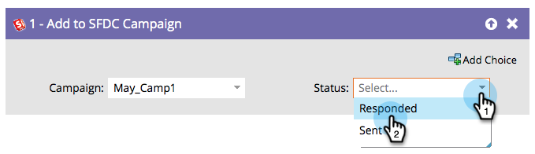

# Lägg till i SFDC Campaign {#add-to-sfdc-campaign}

Det här flödessteget kan användas i Marketo Engage-kampanjer eller som ett enda flödessteg för att lägga till personer som leads i en Salesforce-kampanj. Om leadet ännu inte finns i Salesforce synkroniseras det automatiskt och läggs till i kampanjen med den angivna statusen.

>[!NOTE]
>
>Endast tillgängligt när det är integrerat med [!DNL Salesforce].

## Användning {#usage}

1. Sök efter och välj den [!DNL Salesforce]-kampanj som du vill lägga till dina leads i.

   

   >[!TIP]
   >
   >Om du inte kan se någon Salesforce-kampanj i kampanjlistan:
   >
   > 1. Kontrollera att [kampanjsynkroniseringen är aktiverad](/help/marketo/product-docs/crm-sync/salesforce-sync/setup/optional-steps/enable-disable-campaign-sync.md){target="_blank"}.
   > 1. Bekräfta att din [Marketo Sync-användare](/help/marketo/product-docs/crm-sync/salesforce-sync/setup/enterprise-unlimited-edition/step-2-of-3-create-a-salesforce-user-for-marketo-enterprise-unlimited.md){target="_blank"} är en [marknadsföringsanvändare](/help/marketo/product-docs/crm-sync/salesforce-sync/setup/optional-steps/enable-disable-campaign-sync/make-marketo-sync-user-a-marketing-user.md){target="_blank"} i Salesforce.

   >[!TIP]
   >
   >Du kan använda Salesforce kampanj [Mina token](/help/marketo/product-docs/core-marketo-concepts/programs/tokens/managing-my-tokens.md){target="_blank"} för att göra programkloningen enklare.

1. Välj den [!DNL Salesforce]-kampanjmedlemsstatus som du vill tilldela leads när de läggs till.

   

   >[!CAUTION]
   >
   >Om en person redan är huvudmedlem i Salesforce-kampanjen hoppas de över och deras status uppdateras INTE. Du kan använda [ändra deras status i en SFDC-kampanj](/help/marketo/product-docs/core-marketo-concepts/smart-campaigns/salesforce-flow-actions/change-status-in-sfdc-campaign.md){target="_blank"} i stället.
