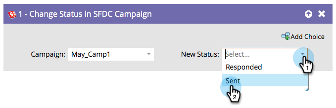

# Ändra status i SFDC-kampanj {#change-status-in-sfdc-campaign}

I det här flödessteget kan du ändra Salesforce-kampanjmedlemmens status för leads.

>[!NOTE]
>
>Endast tillgängligt när det är integrerat med Salesforce.

Om ett lead inte finns i Salesforce eller inte är medlem av kampanjen än, synkroniseras det automatiskt och läggs till i Salesforce-kampanjen med rätt status.

1. Sök först efter och välj Salesforce **[!UICONTROL Campaign]** som posten finns i.

   

1. Välj sedan den **[!UICONTROL New Status]** som du vill ange så är du klar!

   
