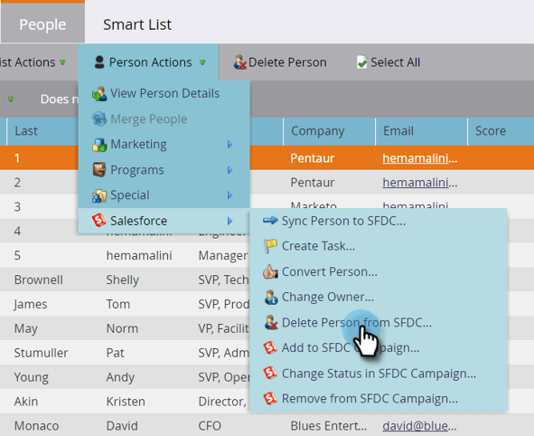

# Ta bort person från SFDC {#delete-person-from-sfdc}

Om du behöver ta bort en viss uppsättning leads från Salesforce men låta dem vara personer i Marketo, kan du använda åtgärden Ta bort person från SFDC-flöde.

>[!NOTE]
>
>Endast tillgängligt när det är integrerat med Salesforce.

1. Klicka i databasen på den person som du vill ta bort från Salesforce. Klicka sedan på **Personåtgärder** och välj **Salesforce**.

   

1. Välj **Ta bort person från SFDC**.

   

1. Kontrollera att inställningen **Ta bort i Marketo** är **false** och klicka sedan på **Kör nu**.

   

   När flödessteget har körts blir din person inte längre en lead i Salesforce, men den blir kvar i Marketo.

   >[!CAUTION]
   >
   >Om du anger **Ta bort i Marketo** till **true** och tar bort personer från Marketo och leads från Salesforce är de borta för alltid. Det här kan inte ångras.
