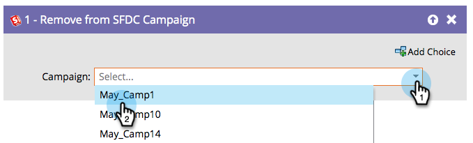

# Ta bort från SFDC-kampanj {#remove-from-sfdc-campaign}

På samma sätt som du kan [Lägg till i SFDC-kampanj](/help/marketo/product-docs/core-marketo-concepts/smart-campaigns/salesforce-flow-actions/add-to-sfdc-campaign.md){target="_blank"} och [Ändra status i SFDC-kampanj](/help/marketo/product-docs/core-marketo-concepts/smart-campaigns/salesforce-flow-actions/change-status-in-sfdc-campaign.md){target="_blank"} kan du även ta bort personer eller leads från en Salesforce-kampanj.

>[!NOTE]
>
>Endast tillgängligt när det är integrerat med Salesforce.

1. När du har dragit i flödessteget letar du reda på och väljer den Salesforce-kampanj som du vill ta bort personen eller leadet från.

   

   >[!TIP]
   >
   >Om personen eller leadet inte är medlem av den kampanj du valde hoppas de över.

Så ja! När personer eller leads flödar igenom tas de bort från Salesforce-kampanjen som du valde.
