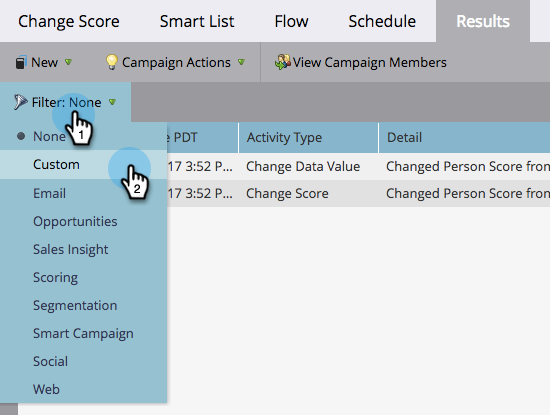

# Filtrera resultat för smart kampanj {#filter-smart-campaign-results}

>[!PREREQUISITES]
>
>[Visa resultat för smarta kampanjer](/help/marketo/product-docs/core-marketo-concepts/smart-campaigns/smart-campaign-data/view-smart-campaign-results.md)

Filtrera resultaten från Smart Campaign för att se specifika aktiviteter som är viktiga för dig.

## Filtrera efter sparade filter {#filter-by-saved-filters}

1. Klicka på **[!UICONTROL Filter]** på fliken Smart Campaign **[!UICONTROL Results]** och välj ett sparat filter.

   

   >[!NOTE]
   >
   >Som standard används inga filter och resultatet visar alla aktiviteter.

## Skapa ett eget filter {#create-a-custom-filter}

1. Klicka på **[!UICONTROL Filter]** och sedan på **[!UICONTROL Custom]**.

   

1. Välj de aktivitetstyper som du vill visa och klicka på **[!UICONTROL Save As]**.

   

   >[!TIP]
   >
   >Klicka på **[!UICONTROL Apply]** om du vill använda ett anpassat filter direkt på resultatet utan att spara det.

1. Ange ett filternamn och klicka på **[!UICONTROL Save]**.

   

1. Det anpassade filtret kommer att tillämpas på dina resultat och är nu tillgängligt i listrutan (du kan behöva uppdatera sidan för att se den i listrutan).

   
