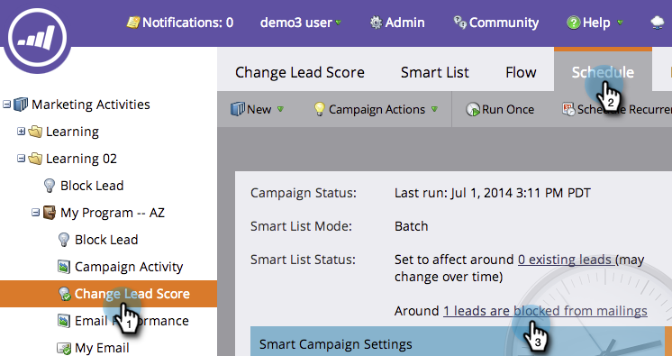

# Visa blockerade personer i en smart kampanj {#view-blocked-people-in-a-smart-campaign}

Spärrade personer i Marketo-databasen har markerats som blocklist, avbeställda, inaktiverade för marknadsföring och/eller har en ogiltig eller tom e-postadress.

>[!NOTE]
>
>Marketo håller på att ändra termer som Blacklist och Whitelist för att Blocklist och Tillåtslista i vår produkt. Under den här uppdateringen kan du se de gamla villkoren i våra användargränssnitt och skärmbilder för dokumentation samt de nya villkoren i vår dokumentationstext. Vi ber om ursäkt för all förvirring.

1. Klicka på **Schedule** i den smarta kampanjen. Klicka på den andra länken under **Status för smart lista**.

   

   >[!NOTE]
   >
   >Personer som nått sin kommunikationsgräns kan också blockeras från att ta emot e-post. Lär dig hur du [redigerar kommunikationsgränser](/help/marketo/product-docs/administration/email-setup/enable-communication-limits.md) i administratörsavsnittet.

   Fliken Spärrade personer visar personer som kanske inte tar emot utskick.

   

   >[!NOTE]
   >
   >Operativa e-postmeddelanden skickas till personer som markerats som avbeställda och marknadsföringen har avbrutits.

   >[!MORELIKETHIS]
   >
   >* [Redigera kvalificeringsregler](/help/marketo/product-docs/core-marketo-concepts/smart-campaigns/using-smart-campaigns/edit-qualification-rules-in-a-smart-campaign.md)
   >* [Aktivera kommunikationsgränser](/help/marketo/product-docs/administration/email-setup/enable-communication-limits.md)
   >* [Visa medlemmar i smarta kampanjer](/help/marketo/product-docs/core-marketo-concepts/smart-campaigns/smart-campaign-data/view-smart-campaign-members.md)
   >* [Visa kvalificerade personer i en smart kampanj](/help/marketo/product-docs/core-marketo-concepts/smart-campaigns/smart-campaign-data/view-qualified-people-in-a-smart-campaign.md)

Så där ja! Nu kan du vara medveten om vem som kanske inte får utskick.
