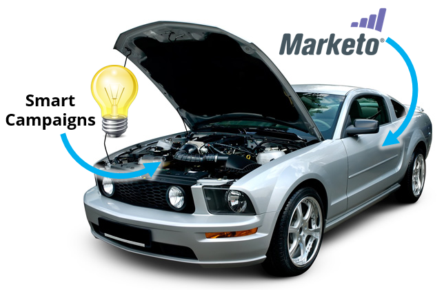

# Om smarta kampanjer {#understanding-smart-campaigns}

Om Marketo är en kraftfull bil är den smarta kampanjen verkligen motorn. Det är enkelt att komma igång, men du kan göra nästan vad du vill av det.

Den smarta kampanjen har tre huvudområden: Flikarna [Smart List](../../../product-docs/core-marketo-concepts/smart-lists-and-static-lists/understanding-smart-lists.md), [Flow](http://docs.marketo.com/display/DOCS/Flow+Actions) och [Schedule](using-smart-campaigns/schedule-a-recurring-batch-campaign.md) .

## Smart List {#smart-list}

Den smarta listan är hur du definierar WHO som du vill ha som mål med din smarta kampanj. Den har filter och utlösare.

<table> 
 <tbody> 
  <tr> 
   <th>Typ</th> 
   <th>Exempel</th> 
   <th>Förklaring</th> 
  </tr> 
  <tr> 
   <td>Filter</td> 
   <td>Klickad länk</td> 
   <td>
Samla alla personer i en batch som är berättigade för tillfället.
</td> 
  </tr> 
  <tr> 
   <td colspan="1">Utlösare</td> 
   <td colspan="1">Klicka på Länk</td> 
   <td colspan="1">Så fort någon gör något, avfyrar flödet omedelbart.</td> 
  </tr> 
 </tbody> 
</table>

Du kan kombinera filter på olika sätt och använda dem tillsammans med utlösare. Det här är ett kraftfullt verktyg - experimentera med det.

## Flöde {#flow}

Flödet innehåller de steg som du vill att den smarta kampanjen ska utföra, inklusive väntesteg och delade val.

## Schema {#schedule}

Slutligen styr detta när ni kör er smarta kampanj. Du kan till och med ställa in upprepning så att den körs enligt ett upprepande schema.

  

Det finns en enorm mängd saker som den smarta kampanjen kan göra. Häng med så hittar du allt i Marketo som blir enklare att förstå.

>[!NOTE]
>
>**Relaterade artiklar**
>
>* [Skapa en ny smart kampanj](creating-a-smart-campaign/create-a-new-smart-campaign.md)

