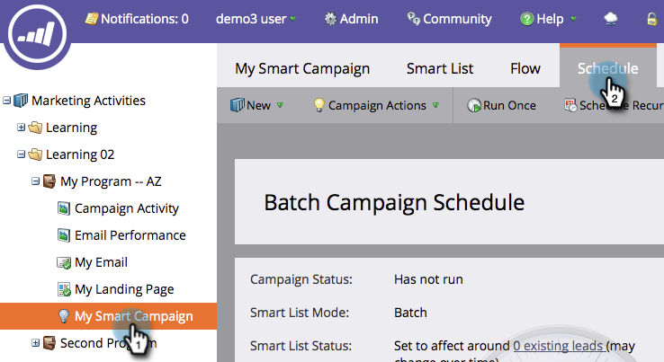

# Avbryt en smart kampanj {#abort-a-smart-campaign}

>[!CAUTION]
>
>Endast för användning i nödsituationer

Ibland startar man en smart kampanj och inser omedelbart att det var ett misstag. Så här drar du in nödbromsen och stoppar den smarta kampanjen mitt i körningen.

1. Under **Marknadsföringsaktiviteter** väljer du din smarta kampanj och går till fliken **Schema** .

   

1. Klicka på listrutan* Kampanjåtgärder**. Välj **Avbryt kampanj**.

   

1. Bekräfta genom att klicka på **Avbryt** .

   

   >[!NOTE]
   >
   >**Påminnelse**
   >
   >
   >Om du avbryter ångras inte steg som redan är klara, det stoppar bara mer från att hända. (Exempel: E-postmeddelanden kan inte tas bort.)

   

   >[!NOTE]
   >
   >Ta en titt på fliken **Resultat** i den smarta kampanjen för att se vilka åtgärder som utfördes före avbrottet. Du hittar också ett [meddelande](../../../../product-docs/core-marketo-concepts/miscellaneous/understanding-notifications.md) med ytterligare information.

   >[!TIP]
   >
   >Vill du ta bort en person från flödet i en utlösarkampanj? Kolla in [Ta bort från flöde](../../../../product-docs/core-marketo-concepts/smart-campaigns/flow-actions/remove-from-flow.md).

Dubbelkontrollera alltid ditt arbete, men nödbromsen kan komma till användning i framtiden.