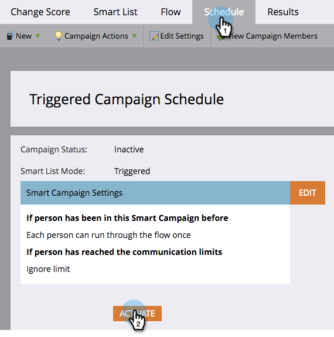

# Aktivera en utlösare för smart kampanj | Fliken Schema {#activate-a-trigger-smart-campaign-schedule-tab}

Att aktivera en utlösare för Smart Campaign är som att aktivera den. Så här gör du.

1. I Smart Campaigns **Schema** flik, klicka **Aktivera**.

   

   >[!TIP]
   >
   >Granska den smarta kampanjen innan du aktiverar den.

1. Klicka **Aktivera** igen.

   

   >[!CAUTION]
   >
   >Se till att kampanjen är klar innan du aktiverar den!

Från och med nu kommer alla som uppfyller kraven för Smart List att gå igenom det flöde som definieras av Smart Campaign.
