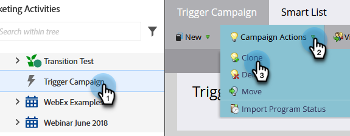
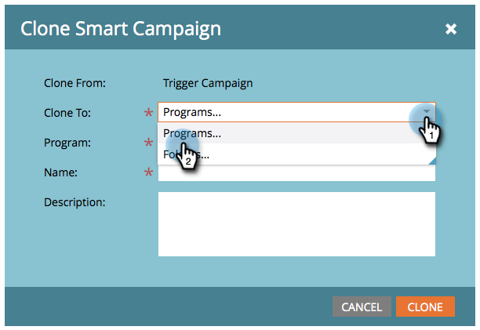

# Kampanjåtgärder: Klona en smart kampanj {#campaign-actions-clone-a-smart-campaign}

Kloningskampanjer kan spara tid åt er. Du behöver inte skapa allt från början - kloningen skapar en identisk kampanj med exakt samma smarta listfilter och flödessteg.

1. Välj den kampanj som du vill klona. I **Kampanjåtgärder** nedrullningsbar meny, välja **Klona**.

   

1. Välj lämplig **Klona till** alternativ. I det här exemplet väljer vi **Program**.

   

1. Välj en **Program**. Ange **Kampanjnamn** och klicka **Klona**.

   

Och klart!
