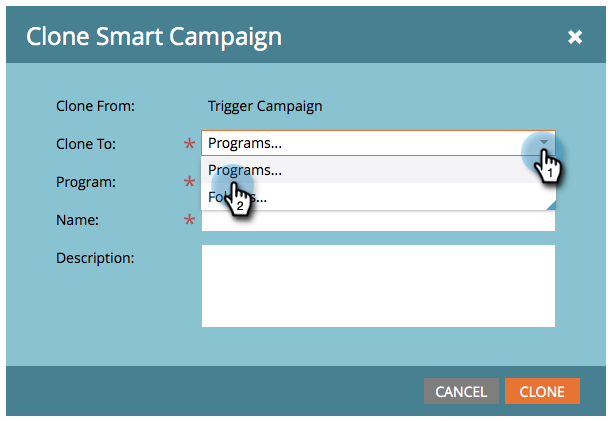

# Kampanjåtgärder: Klona en smart kampanj {#campaign-actions-clone-a-smart-campaign}

Kloningskampanjer kan spara tid åt er. Du behöver inte skapa allt från början - kloningen skapar en identisk kampanj med exakt samma smarta listfilter och flödessteg.

1. Välj den kampanj som du vill klona. Välj **[!UICONTROL Campaign Actions]** i listrutan **[!UICONTROL Clone]**.

   

1. Välj lämpligt **[!UICONTROL Clone To]**-alternativ. I det här exemplet väljer vi **[!UICONTROL Programs]**.

   

1. Välj en **[!UICONTROL Program]**. Ange en **[!UICONTROL Campaign Name]** och klicka på **[!UICONTROL Clone]**.

   

Och klart!
