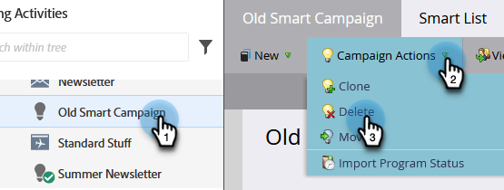

# Kampanjåtgärder: Ta bort en smart kampanj {#campaign-actions-delete-a-smart-campaign}

Om du har en gammal Smart Campaign som du inte längre behöver kan du ta bort den. Så här gör du.

>[!CAUTION]
>
>Se till att du är säker innan du tar bort. När du har tagit bort en smart kampanj kan den inte återställas.

1. Gå till området **[!UICONTROL Marketing Activities]**.

   

1. Navigera till din inaktiva smarta kampanj. Välj **[!UICONTROL Campaign Actions]** i listrutan **[!UICONTROL Delete]**.

   

   >[!TIP]
   >
   >Om du vill avbryta bearbetningen av en aktiv smart kampanj utan att ta bort den helt och hållet, ska du lära dig hur du [avbryter en smart kampanj](/help/marketo/product-docs/core-marketo-concepts/smart-campaigns/using-smart-campaigns/abort-a-smart-campaign.md).

1. Bekräfta genom att klicka på **[!UICONTROL Delete]**.

   

   >[!CAUTION]
   >
   >Ta INTE bort en aktiv smart kampanj med personer i flödesstegen. Kampanjen kommer troligtvis fortfarande att genomföras.
