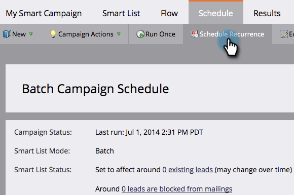

# Avbryt en schemalagd återkommande batchkampanjkörning {#cancel-a-scheduled-recurring-batch-campaign-run}

Om du har en återkommande batchkampanj som du inte vill ha mer kan du avbryta framtida körningar. Så här gör du.

1. Klicka på den smarta kampanjen och sedan på fliken **Schedule**.

   

1. Klicka på **Schemalägg upprepning**.

   

   >[!TIP]
   >
   >Du kan avbryta en enskild körning genom att klicka på  bredvid den. Lär dig hur du [avbryter en schemalagd batchkampanjkörning](/help/marketo/product-docs/core-marketo-concepts/smart-campaigns/using-smart-campaigns/cancel-a-scheduled-batch-campaign-run.md).

1. Ange Schemalägg till **Ingen** och **Spara**.

   

   Voila! Din smarta kampanj kommer inte att köras längre.

   >[!CAUTION]
   >
   >Detta avbryter framtida körningar, men om en smart kampanj körs kan du inte avbryta den.

   >[!MORELIKETHIS]
   >
   >[Avbryt en schemalagd batchkampanjkörning](/help/marketo/product-docs/core-marketo-concepts/smart-campaigns/using-smart-campaigns/cancel-a-scheduled-batch-campaign-run.md)
