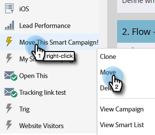

# Flytta en smart kampanj {#move-a-smart-campaign}

Flytta en smart kampanj mellan olika program eller mappar genom att dra och släppa eller flytta i trädet. Reglerna för er smarta kampanj kommer inte att ändras, utan bara kapslas på en annan plats.

1. Gå till **Marknadsföringsaktiviteter**.

   

1. Leta reda på den smarta kampanj du vill flytta, högerklicka på den och välj **Flytta**.

   

1. Välj **To** (destination), **Program** och valfri **Mapp**. Välj **Flytta**.

   

   >[!NOTE]
   >
   >I det här exemplet flyttar vi den smarta kampanjen till ett annat program, men du kan också flytta den till en kampanjmapp.

Bra gjort! Den smarta kampanjen har flyttats.

