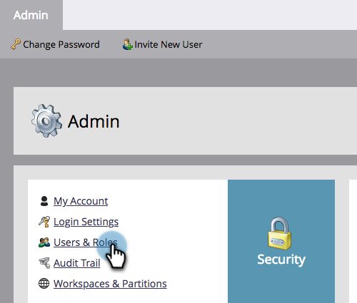

# Åsidosättning av prioritet för utlösarkampanjer {#priority-override-for-trigger-campaigns}

Administratörer kan åsidosätta den av Marketo Engage fastställda prioriteten för utlösarkampanjer för att ange prioriteringar som bättre överensstämmer med affärsmålen.

>[!NOTE]
>
>Den här funktionen är bara tillgänglig för utlösarkampanjer och för användare som har beviljats behörigheten [&quot;Redigera utlösarkampanjprioritet&quot; ](#grant-priority-override-access).

>[!CAUTION]
>
>Vi rekommenderar starkt att du använder den här funktionen för en begränsad uppsättning affärskritiska kampanjer (25 är det rekommenderade maxvärdet). Om du använder funktionen löst i en stor uppsättning kan det påverka kampanjkörningen negativt.

## Åsidosätt åtkomst med Bevilja prioritet {#grant-priority-override-access}

>[!NOTE]
>
>Endast administratörer eller användare med administratörsansvar bör ha åtkomst till åsidosättande av kampanjprioritet.

1. Klicka på **[!UICONTROL Admin]** i området **[!UICONTROL Users & Roles]**.

   

1. Klicka på fliken **[!UICONTROL Roles]**, markera den användare som du vill ge åtkomst till och klicka sedan på **[!UICONTROL Edit Role]**.

   

1. Under **[!UICONTROL Access Marketing Activities]** väljer du **[!UICONTROL Edit Trigger Campaign Priority]**. Klicka på **[!UICONTROL Save]**.

   

## Åsidosätt prioritet {#override-priority}

1. Hitta din utlösarkampanj. Högerklicka på den och välj **[!UICONTROL Override Campaign Priority]**.

   

1. Klicka på skjutreglaget **[!UICONTROL Override Campaign Priority]** för att aktivera. Välj en ny prioritetsnivå och klicka på **[!UICONTROL Confirm]**.

   

   Den nya prioritetsnivån visas på fliken **[!UICONTROL Schedule]**.

   

>[!NOTE]
>
>* Du kan visa kampanjens standardprioritet i [!UICONTROL Campaign Queue] under [!UICONTROL Marketing Activities]. Vi rekommenderar att du ställer in kampanjprioriteten på en nivå som är högre än standardnivån för att öka exekveringsfrekvensen.
>* Prioriteten för användarinställningen gäller endast för nya personer som är kvalificerade för kampanjen. Personer som redan är i kö påverkas inte.
>* Prioritetsåsidosättningar hämtas i [Granskningsspår](/help/marketo/product-docs/administration/audit-trail/audit-trail-overview.md){target="_blank"}.
