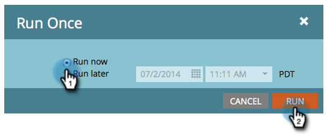

# Kör en batchsmart kampanj nu | Fliken Schema {#run-a-batch-smart-campaign-now-schedule-tab}

När du är klar med gruppkampanjen kan du välja att köra den nu eller senare. Så här kör du det omedelbart.

1. Välj den smarta gruppkampanjen, gå till **Schema** och klicka **Kör en gång**.

   

1. Se till att **Kör nu** är markerat och klickar **Kör**.

   

1. Bekräfta genom att klicka **Kör** en gång till.

   

   Ta det lugnt! Du kan också [scheman körs senare](/help/marketo/product-docs/core-marketo-concepts/smart-campaigns/using-smart-campaigns/schedule-a-batch-smart-campaign-to-run-later.md) om du vill.

   >[!NOTE]
   >
   >* [Schemalägg en batchsmart kampanj att köras senare](/help/marketo/product-docs/core-marketo-concepts/smart-campaigns/using-smart-campaigns/schedule-a-batch-smart-campaign-to-run-later.md)
   >* [Schemalägg en återkommande batchkampanj](/help/marketo/product-docs/core-marketo-concepts/smart-campaigns/using-smart-campaigns/schedule-a-recurring-batch-campaign.md)
