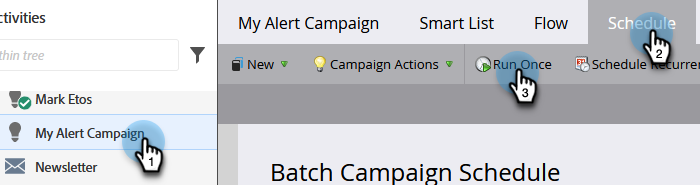
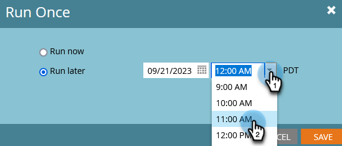
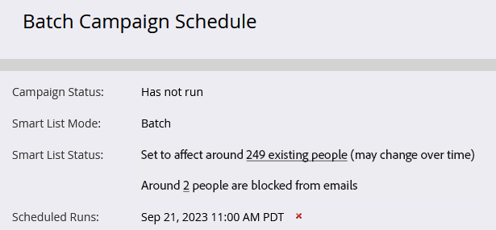

# Schemalägg en batchsmart kampanj att köras senare {#schedule-a-batch-smart-campaign-to-run-later}

Så här gör du om du vill ställa in en batchsmart kampanj som ska köras någon gång i framtiden.

>[!TIP]
>
>Du kan också [schemalägga om en batchsmart kampanj i programschemavyn](/help/marketo/product-docs/core-marketo-concepts/programs/program-schedule-view/reschedule-a-batch-smart-campaign-in-the-program-schedule-view.md).

1. Välj den batchsmarta kampanj som du vill köra, gå till **Schema** och klicka på **Kör en gång**.

   

1. Klicka **Kör senare** klickar du sedan på kalenderikonen och väljer den dag du vill att den smarta kampanjen ska köras på.

   

1. Välj den tid du vill att den smarta kampanjen ska köras (minst 15 minuter framåt).

   

1. Klicka **Spara**.

   

1. Du kan bekräfta den schemalagda körningen genom att titta på **Schema** -fliken.

   

   >[!NOTE]
   >
   >[Schemalägg en återkommande batchkampanj](/help/marketo/product-docs/core-marketo-concepts/smart-campaigns/using-smart-campaigns/schedule-a-recurring-batch-campaign.md)
