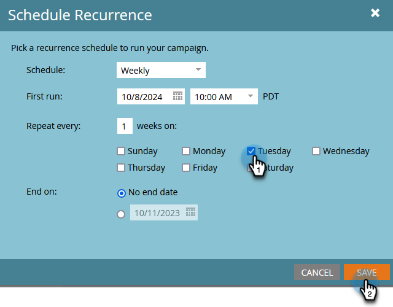

# Schemalägg en återkommande batchkampanj {#schedule-a-recurring-batch-campaign}

Med Återkommande kan ni köra en gruppkampanj enligt ett regelbundet schema. Exempel: en gång i veckan, tisdagar klockan 10:00.

1. Välj Smart Campaign, gå till **Schema** och klicka på **Schemalägg upprepning**.

   

1. Klicka på **Schema** nedrullningsbar meny och välj **Vecka**.

   

1. Klicka på kalenderikonen och välj önskad dag för den första körningen.

   

1. Välj den tidpunkt då den ska köras.

   

1. Behåll Upprepa var som 1, välj Tisdag och klicka **Spara**.

   

   >[!NOTE]
   >
   >För en viss körlängd kan du klicka på kalenderikonen bredvid **Slutar på** och välja slutdatum.

De schemalagda upprepningarna visas längst ned på fliken Schema.

>[!NOTE]
>
>På fliken Schema visas de tre följande förekomsterna som referens. Klicka på det röda **X** avbryter den specifika körningen.
