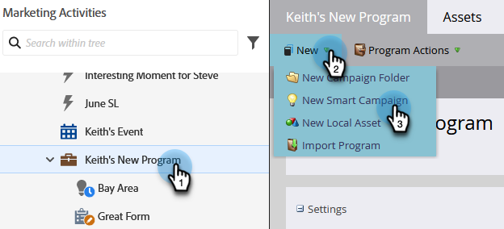
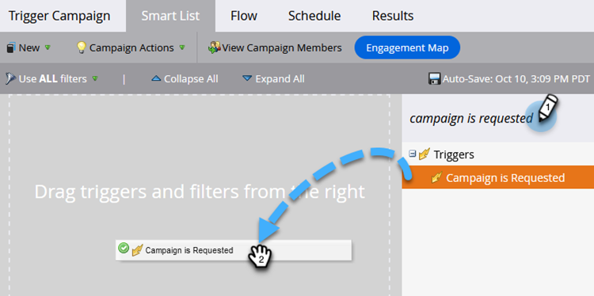

# Konfigurera en utlösare smart kampanj för försäljning med&quot;Campaign is Requested&quot; {#setting-up-a-trigger-smart-campaign-for-sales-using-campaign-is-requested}

En av de coolaste funktionerna i Marketo är möjligheten att låta säljarna delta i marknadsföringen. De är på framsidan och interagerar med människor. Säljarna bör kunna styra marknadsföringen i rätt riktning.

>[!NOTE]
>
>Exempel på smarta kampanjer att begära:
>
>1. **Långsiktig vårdnadshavare** - när de inte har någon budget i år och du bara vill stanna kvar på radarn
>1. **Aktiv försäljningscykel** - när säljaren inte vill ha några meddelanden till personen förutom sina egna. (använd den flagga som anger att marknadsföringen har pausats för att tillfälligt avbryta prenumerationen)
>
>Var kreativ. Vad vill säljaren automatisera? Fråga dem bara och vrida upp den!

1. Skapa en smart kampanj.

   

1. Hitta och dra **[!UICONTROL Campaign is Requested]**-utlösaren till arbetsytan.

   

1. Källalternativen anger vilken typ av begäran som kommer att utföras. För Salesforce-funktioner måste du välja **[!UICONTROL Sales Insight]**.

   >[!TIP]
   >
   >Källoperatorerna är av säkerhetsskäl. Du kan begränsa kampanjen till förfrågningar som bara görs av specifika källor, som andra smarta kampanjer eller utvecklare. Välj **[!UICONTROL Is Any]** i den första rutan om du vill tillåta begäranden från alla källor.
   >
   >_Kom ihåg_. Genom att välja Sales Insight visas det magiskt i kartongen för försäljning. Överdriv det inte. För många kommer att ignoreras av dem.

   

Detta är ett bra sätt att utöka er marknadsföringsräckvidd till andra avdelningar. Skapa alla typer av kampanjer som kan automatiseras.

>[!TIP]
>
>Glöm inte att tydligt namnge era smarta kampanjer. De visas i Sales Insight exakt hur du namnger dem.
