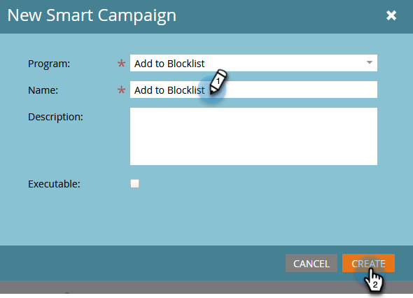

# Lägg till person i Blockeringslista {#add-person-to-blocklist}

Genom att lägga till personer på Blockeringslista kan de inte ta emot din korrespondens.

1. [Skapa ett nytt standardprogram](/help/marketo/product-docs/core-marketo-concepts/programs/creating-programs/create-a-program.md) och namnge **Lägg till i Blockeringslista**.

1. Klicka **Nytt** och markera **Ny lokal resurs**.

   

1. Välj **Smart List**.

   

1. Namnge listan och klicka på **Skapa**.

   

1. Lägg till alla personer i **Smart List** som du vill lägga till i Blockeringslista.

   

   >[!NOTE]
   >
   >Personer på ditt Blockeringslista får inte några operativa e-postmeddelanden.

1. Gå tillbaka till programmet.

   

1. Klicka **Nytt** och markera **Ny smart kampanj**.

   

1. Namnge **Ny smart kampanj**. Klicka **Skapa**.

   

1. Dra och släpp **Medlem i Smart List**.

   

1. Välj den smarta listan som du nyss skapade.

   

1. Klicka på **Flöde** -fliken. Dra och släpp **Ändra datavärde** Flödesåtgärd.

   

1. I **Attribut** nedrullningsbar markering **Blocklista** och ange **Nytt värde** till **true**.

   

1. Klicka på **Schema** och markera **Kör en gång**.

   

1. Välj **Kör nu** och klicka **Kör**.

   

1. Klicka **Kör** igen.

   

Dessa personer kommer inte längre att få e-post.

>[!TIP]
>
>Skapa en [utlösa smart kampanj](/help/marketo/product-docs/core-marketo-concepts/smart-campaigns/creating-a-smart-campaign/create-a-new-smart-campaign.md) använda **Ändra datavärde** med **Blocklistan är sann** för alla i framtiden som har attribut som kan blocklist.
