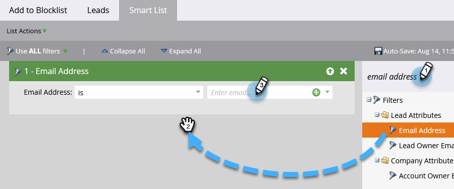
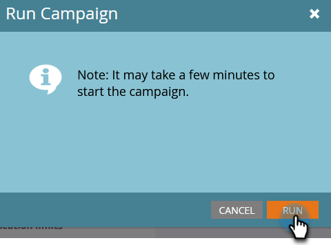

# Lägg till person i Blockeringslista {#add-person-to-blocklist}

Genom att lägga till personer på Blockeringslista kan de inte ta emot din korrespondens.

1. Skapa ett nytt [standardprogram](/help/marketo/product-docs/core-marketo-concepts/programs/creating-programs/create-a-program.md){target="_blank"} och ge det namnet&quot;Lägg till i Blockeringslista&quot;.

1. Klicka på **[!UICONTROL New]** och välj **[!UICONTROL New Local Asset]**.

   

1. Välj **[!UICONTROL Smart List]**.

   

1. Namnge listan och klicka på **[!UICONTROL Create]**.

   

1. Lägg till alla personer i din smarta lista som du vill lägga till i Blockeringslista.

   

   >[!NOTE]
   >
   >Personer på ditt Blockeringslista får inte några operativa e-postmeddelanden.

1. Gå tillbaka till programmet.

   

1. Klicka på **[!UICONTROL New]** och välj **[!UICONTROL New Smart Campaign]**.

   

1. Ge den nya smarta kampanjen ett namn. Klicka på **[!UICONTROL Create]**.

   

1. Dra och släpp **[!UICONTROL Member of Smart List]**.

   

1. Välj den smarta lista du just skapade.

   

1. Klicka på fliken **[!UICONTROL Flow]**. Dra och släpp **[!UICONTROL Change Data Value]**-flödesåtgärden.

   

1. I listrutan **[!UICONTROL Attribute]** väljer du **[!UICONTROL Block Listed]** och anger **[!UICONTROL New Value]** till **[!UICONTROL true]**.

   

1. Klicka på fliken **[!UICONTROL Schedule]** och välj **[!UICONTROL Run Once]**.

   

1. Markera **[!UICONTROL Run Now]** och klicka på **[!UICONTROL Run]**.

   

1. Klicka på **[!UICONTROL Run]** igen.

   

Dessa personer kommer inte längre att få e-post.

>[!TIP]
>
>Skapa en [utlösarkampanj](/help/marketo/product-docs/core-marketo-concepts/smart-campaigns/creating-a-smart-campaign/create-a-new-smart-campaign.md){target="_blank"} med **Ändra datavärde** med **Blocklistan är true** för alla personer i framtiden som har attribut som kan blocklist.
