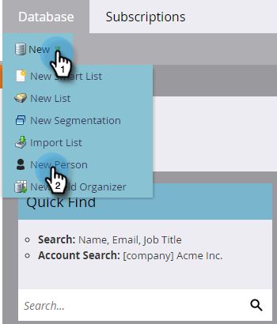

# Skapa en person manuellt {#create-a-person-manually}

Det finns många sätt att få in en person i Marketo Engage. Så här skapar du en manuellt.

>[!CAUTION]
>
>Marketo stöder inte e-postadresser som innehåller känslolägesikoner.

1. Gå till **[!UICONTROL Database]**.

   

1. Klicka på **[!UICONTROL New Person]** under **[!UICONTROL New]**.

   

1. Ange personens information och klicka sedan på **[!UICONTROL Create]**.

   
