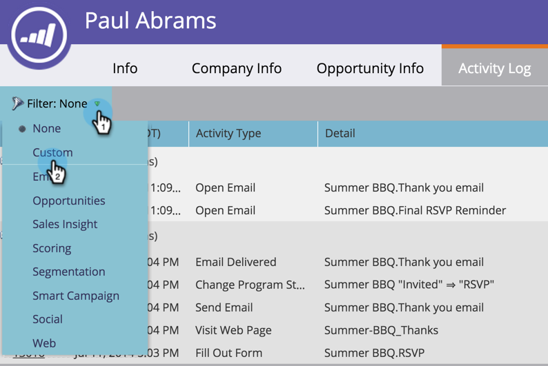

# Filtrera aktivitetstyper i aktivitetsloggen för en person {#filter-activity-types-in-the-activity-log-of-a-person}

Sök efter aktiviteter som är viktiga för dig i aktivitetsloggen.

>[!NOTE]
>
>Läs mer om [aktivitetsloggen](/help/marketo/product-docs/core-marketo-concepts/smart-lists-and-static-lists/managing-people-in-smart-lists/locate-the-activity-log-for-a-person.md).

1. Gå till sidan **Personinformation**. Klicka på fliken **Aktivitetslogg**.

   

1. Välj listrutan **Filter**.

   

## Skapa anpassade filter {#creating-custom-filters}

1. Klicka på listrutan **Filter**. Välj **Anpassad**.

   

1. Välj aktiviteter att filtrera efter. Klicka på **Spara som**.

   

1. Ange ett **eget filternamn**. Klicka på **Spara**.

   

   Nu visas bara aktiviteter som uppfyller filtervillkoren.

   

## Referens för sparade filter {#reference-saved-filters}

Det går att komma åt sparade filter från listrutan **Filter**.

1. Klicka på listrutan **Filter**. Välj **Anpassad**.

   

1. Klicka på **Sparade filter**. Sparade filter visas nedan.

   
