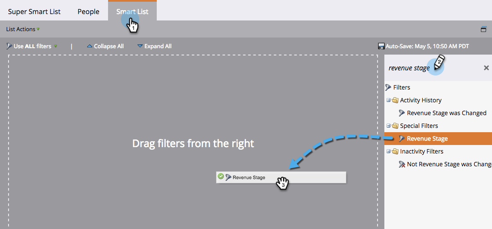

# Söka efter alla personer i en intäktsfas {#find-all-people-in-a-revenue-stage}

>[!PREREQUISITES]
>
>[Skapa en smart lista](/help/marketo/product-docs/core-marketo-concepts/smart-lists-and-static-lists/creating-a-smart-list/create-a-smart-list.md){target="_blank"}

## Sök efter alla medlemmar i en viss intäktsfas {#find-all-members-of-a-specific-revenue-stage}

1. I en smart lista klickar du på **[!UICONTROL Smart List]** -flik finns i **[!UICONTROL Revenue Stage]** och dra den till arbetsytan.

   

1. Välj en **[!UICONTROL Revenue Stage]**.

   

1. Gå till **[!UICONTROL People]** för att visa resultatet.

   

## Köra ett flödessteg på medlemmarna i en intäktsfas {#run-a-flow-step-on-the-members-of-a-revenue-stage}

Nu när ni vet vilka människor som befinner sig i vilka intäktsfaser kan ni marknadsföra direkt till dem. Förutom att välja **[!UICONTROL Revenue Stage]** som ett smart listfilter kan du även välja det som ett if-filter i flödet.

1. Klicka på **[!UICONTROL Add Choice]** och markera **[!UICONTROL Revenue Stage]** i listrutan.

   

   Därifrån kan du välja vilka medlemmar som ska påverkas av vilken aspekt av flödessteget.
