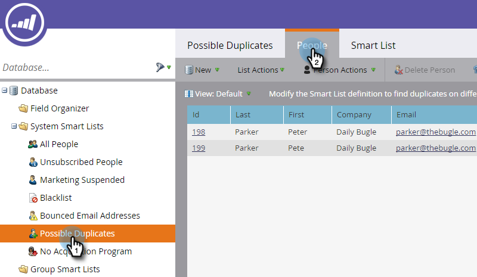

# Sök och sammanfoga duplicerade personer {#find-and-merge-duplicate-people}

Marketo tar automatiskt bort dubbletter när nya personer kommer in i systemet. CRM kan dock ha skickat dubbletter till Marketo från början. Så här sammanfogar du dem.

>[!NOTE]
>
>**FYI**
>
>Marketo standardiserar nu språk för alla prenumerationer, så du kan se lead/leads i din prenumeration och person/personer på docs.marketo.com. Dessa termer betyder samma sak. det påverkar inte artikelinstruktionerna. Det finns andra förändringar också. [Läs mer](http://docs.marketo.com/display/DOCS/Updates+to+Marketo+Terminology).

>[!NOTE]
>
>Marketo avduplicerar inte automatiskt mot en Salesforce- eller Microsoft Dynamics-synkronisering eller när du anger personer manuellt.

>[!PREREQUISITES]
>
>När du söker efter och sammanfogar dubbletter används [inbyggda/systemsmarta listor](../../../../product-docs/core-marketo-concepts/smart-lists-and-static-lists/using-smart-lists/use-built-in-system-smart-lists.md).

## Sök dubbletter {#find-duplicates}

1. Gå till området **Databas** .

   

   >[!CAUTION]
   >
   >Det kanske inte fungerar att sammanfoga personer i Marketo om du använder ett Salesforce-personkonto. Sammanfoga posterna i Salesforce om det är möjligt.

1. Välj den smarta listan **Möjliga** **dubbletter** av systemet och klicka på fliken **Personer** .

   

   >[!NOTE]
   >
   >Du kan också [söka efter duplicerade personer med anpassad logik](find-duplicate-people-with-custom-logic.md).

## Sammanfoga personer manuellt {#merge-people-manually}

>[!CAUTION]
>
>När du sammanfogar personer och den person som förlorar har ett anpassat Marketo-objekt, kopplas det **inte** till den som vinner. Överför det anpassade objektet igen innan du utför sammanfogningen.

Markera dubbletterna genom att hålla ned Ctrl/Cmd och klicka på Sammanfoga personer.

>[!TIP]
>
>Du kan ha två eller flera dubbletter för samma person - markera alla samtidigt.

1. Du ser värdena mellan posterna som *inte* matchar. Välj det värde som du vill behålla för varje fält. Klicka på **Sammanfoga** när du är klar. Om du inte vill ha något av värdena kan du markera **Egen** och ange ett värde.

   

   >[!NOTE]
   >
   >När man sammanfogar personer manuellt blir den första personen&quot;vinnaren&quot;. Så om du sammanfogar post-ID:n 198 och 1999 på fliken Folk och klickar på 199 först blir 199 post-ID:t för de sammanfogade personerna. Detta gäller även om fler än två poster sammanfogas.

   >[!TIP]
   >
   >Det är bättre att sammanfoga än att ta bort. Du sparar all historik (sidbesök, länkklick, e-postöppningar, formulärfyllningar osv.).

## Effekt i Salesforce {#effect-in-salesforce}

Om du har Salesforce-integrering finns det några noteringar om effekten av Sammanfoga leads i Salesforce.

    * När du bara sammanfogar leads eller enbart kontakter sammanfogas de enligt vanliga Salesforce-regler.
    * När du sammanfogar leads och kontakter konverteras alla leads till kontakter innan de sammanfogas enligt vanliga Salesforce-regler.

Mer information om Salesforce-beteendet när du sammanfogar leads eller kontakter finns i följande Salesforce-dokument:

    * [Sammanfoga dubblettrader](https://help.salesforce.com/HTViewHelpDoc?id=leads_merge.htm&amp;language=en_US)
    * [Sammanfoga dubblettkontakter](https://help.salesforce.com/HTViewHelpDoc?id=contacts_merge.htm&amp;language=en_US)

## Masssammanslagning {#bulk-merging}

Om du har för många dubbletter för att sammanfoga manuellt kan du kontakta din Customer Success Manager och diskutera dina alternativ.

Suverän! Om du är ansluten till en CRM sammanfogas posterna där enligt reglerna nedan.