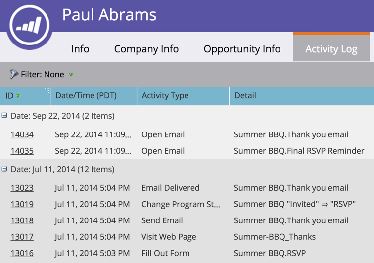

# Leta reda på aktivitetsloggen för en person {#locate-the-activity-log-for-a-person}

Aktivitetsloggen är den ultimata källan till sanning. Det här är den fullständiga historien om en persons resa i Marketo.

>[!NOTE]
>
>**FYI**
>
>Marketo standardiserar nu språk för alla prenumerationer, så du kan se lead/leads i din prenumeration och person/personer på docs.marketo.com. Dessa termer betyder samma sak. det påverkar inte artikelinstruktionerna. Det finns andra förändringar också. [Läs mer](http://docs.marketo.com/display/DOCS/Updates+to+Marketo+Terminology).

1. Gå till databasen***.

   

1. Välj **Alla personer**.

   

1. Klicka på fliken **Personer** . Välj ett person- **ID** -nummer.

   

1. Klicka på **Aktivitetslogg**.

   

   Se upp. Aktivitetsloggen! Detta är en samling med all information som sker över tid för en person.

   

   >[!NOTE]
   >
   >**Relaterade artiklar**
   >
   >
   >Läs mer om hur du [filtrerar aktivitetsloggen](filter-activity-types-in-the-activity-log-of-a-person.md)för att se specifika personaktiviteter.

