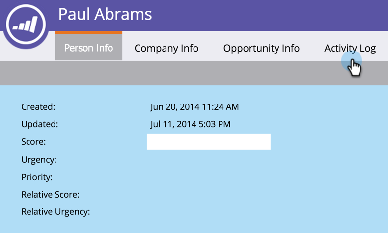

# Leta reda på aktivitetsloggen för en person {#locate-the-activity-log-for-a-person}

Aktivitetsloggen är den ultimata källan till sanning. Det här är den fullständiga historien om en persons resa i Marketo.

1. Gå till **Databas**.

   

1. Välj **Alla personer**.

   

1. Klicka på **Folk** -fliken. Välj en person **ID** tal.

   

1. Klicka **Aktivitetslogg**.

   

   Du har nu en samling med all information som händer över tid för en person.

   

## Exportera aktivitetslogg {#export-activity-log}

Behöver du exportera en persons aktivitetslogg till Excel?

1. När du har följt stegen ovan bläddrar du längst ned på sidan och väljer ikonen Exportera.

   

1. En Excel-fil hämtas till webbläsaren.

   

   >[!MORELIKETHIS]
   >
   >Läs mer om [filtrera aktivitetsloggen](/help/marketo/product-docs/core-marketo-concepts/smart-lists-and-static-lists/managing-people-in-smart-lists/filter-activity-types-in-the-activity-log-of-a-person.md) för att se specifik personverksamhet.
