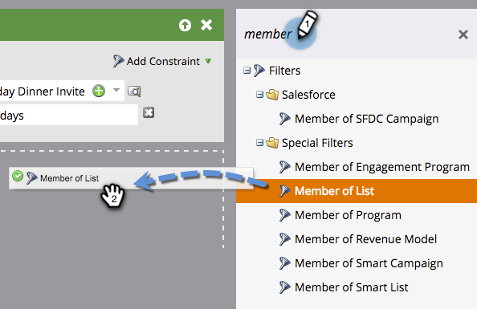

# Använda listmedlemmar i en smart lista {#use-members-of-list-in-a-smart-list}

>[!TIP]
>
>Du kan lägga till personer i en lista med hjälp av [Importera](/help/marketo/getting-started/quick-wins/import-a-list-of-people.md) eller [Lägg till i listflödessteget](/help/marketo/product-docs/core-marketo-concepts/smart-campaigns/flow-actions/add-to-list.md){target="_blank"}.

Med det här filtret kan du hämta medlemmar från en annan lista genom att referera till den i reglerna för smarta listor. Så här gör du.

1. Välj en smart lista och klicka på fliken **[!UICONTROL Smart List]**.

   

1. På den högra filterpanelen söker du efter och drar filtret **[!UICONTROL Member of List]** till arbetsytan.

   

1. Klicka på listrutan eller skriv för att söka efter listan som du vill ta med i din smarta lista.

   

   Klart! I det här exemplet kommer den smarta listan nu endast att rikta sig till medlemmar i den listan och utvärdera dem baserat på andra regler som du inkluderar.
