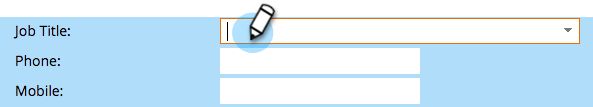

# Använda personinformationssidan {#using-the-person-detail-page}

Personinformationssidan innehåller all information som Marketo känner till om en person. Du kan redigera data direkt från den här sidan.

## Komma till personinformationssidan {#getting-to-person-detail-page}

Det finns många sätt att öppna specifika personer. Några exempel visas nedan.

>[!NOTE]
>
>**Exempel**
>
>* I **databasen** kan du söka i Snabbsökning
>* Valfri smart **lista** eller lista
>* **Medlemskap** i ett program
>* **Visa kampanjmedlemskap** i en smart kampanj
>* Vissa **rapporter**

>

1. Dubbelklicka på en person eller klicka en gång på ID:t till vänster.

   

1. Detta öppnar skärmen för personinformation.

   

## Sidorganisation - Salesforce {#page-organization-salesforce}

Personinformation kategoriseras på följande flikar:

| Tabb | Beskrivning |
|---|---|
| Info | Kontaktinformation och anpassade fält om en person. |
| Företagsinformation | Personens företagsinformation och adress. |
| Information om affärsmöjlighet | Information om affärsmöjlighet synkroniserad från Salesforce. |
| SFDC-huvudfält | Inbyggda Salesforce-fält. |
| SFDC anpassat fält | Anpassade Salesforce-fält. |
| Aktivitetslogg | Alla aktiviteter som rör personen. |

## Sidorganisation - Microsoft Dynamics {#page-organization-microsoft-dynamics}

| Tabb | Beskrivning |
|---|---|
| Info | Kontaktinformation och anpassade fält om en person. |
| Företagsinformation | Personens företagsinformation och adress. |
| Information om affärsmöjlighet | Information om affärsmöjlighet synkroniserad från Microsoft. |
| Anpassade fält från Microsoft | Anpassade Microsoft-fält. |
| Microsoft Lead-fält | Inbyggda Microsoft-fält. |
| Aktivitetslogg | Alla aktiviteter som rör personen. |

## Redigera ett fält {#editing-a-field}

Många fält kan redigeras. Om du vill uppdatera en persons information skriver du in ett nytt värde och klickar utanför fältet för att spara.

## Marketo-standardfält före CRM-synkronisering {#marketo-default-fields-prior-to-crm-sync}

|  |  |  |  |  |
|---|---|---|---|---|
| Adress | Årsintäkt | Anonym IP | Faktureringsadress | Faktureringsort |
| Faktureringsland | Postnummer för fakturering | Faktureringsläge | Ort | Företag |
| Land | Skapad den | Födelsedatum | Avdelning | Ring inte |
| Anropa inte orsak | Anropa inte orsak | E-postadress | Ogiltig e-postadress | Ogiltig e-postorsak |
| ID för externt företag | ID för extern säljare | Faxnummer | Förnamn | Fullständigt namn |
| Bransch | Inaktuell ort | Infört företag | Infört land | Ingående metropolitområde |
| Riktnummer för inkommande telefon | Infört postnummer | Ingångsregion | Är anonym | Är kund |
| Är partner | Befattning | Efternamn | Klassificering | Poäng |
| Personkälla | Status | Huvudtelefon | Marketo - socialt Facebook-visningsnamn | Marketo Social Facebook-ID |
| Marketo Social Facebook Photo URL | Marketo Social Facebook-profils-URL | Marketo Social Facebook Reach | Marketo Social Facebook - refererade registreringar | Marketo Social Facebook Refererade besök |
| Marketo Social Genus | Marketo - senaste refererad registrering | Marketo Social, senaste refererade besök | Marketo socialt LinkedIn-visningsnamn | Marketo social LinkedIn-ID |
| Marketo social LinkedIn Photo URL | Marketo social LinkedIn Profile URL | Marketo Social LinkedIn Reach | Marketo Social LinkedIn Refererade registreringar | Marketo social LinkedIn refererade besök |
| Marketo Social Syndication ID | Marketo - totalt antal refererade registreringar | Marketo - totalt antal refererade besök | Marketo - socialt Twitter-visningsnamn | Marketo Social Twitter-ID |
| Marketo Social Twitter Photo URL | Marketo social Twitter-profils-URL | Marketo Social Twitter Reach | Marketo Social Twitter - refererade registreringar | Marketo Social Twitter refererade besök |
| Mellannamn | Mobiltelefonnummer | Antal anställda | Telefonnummer | Postnummer |
| Prioritet | Relativa poäng | Roll | Hälsning | SIC-kod |
| Plats | Läge | Avbeställ | Orsak till avbeställning | Uppdaterat den |
| Akut | Webbplats |  |  |  |

>[!NOTE]
>
>**Djupdykning**
>
>Vissa fält är *inte* redigerbara:
>
>* Företagsinformation
>* Möjligheter för SFDC-kontakter
>* Vissa Marketinspecifika fält, t.ex. Skapad och Ursprunglig källtyp.
>* Aktivitetslogg

>
>
Läs mer om [Systemhanterade fält](../../../../product-docs/administration/field-management/understanding-system-managed-fields.md).

>[!MORELIKETHIS]
>
>* [Skapa en anpassad flik för personinformationssidan](../../../../product-docs/administration/settings/creating-a-custom-tab-for-the-person-detail-page.md)

>

