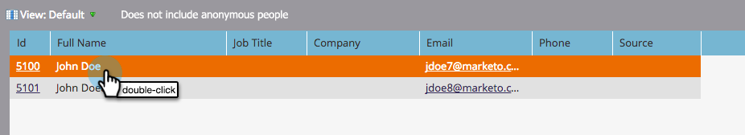
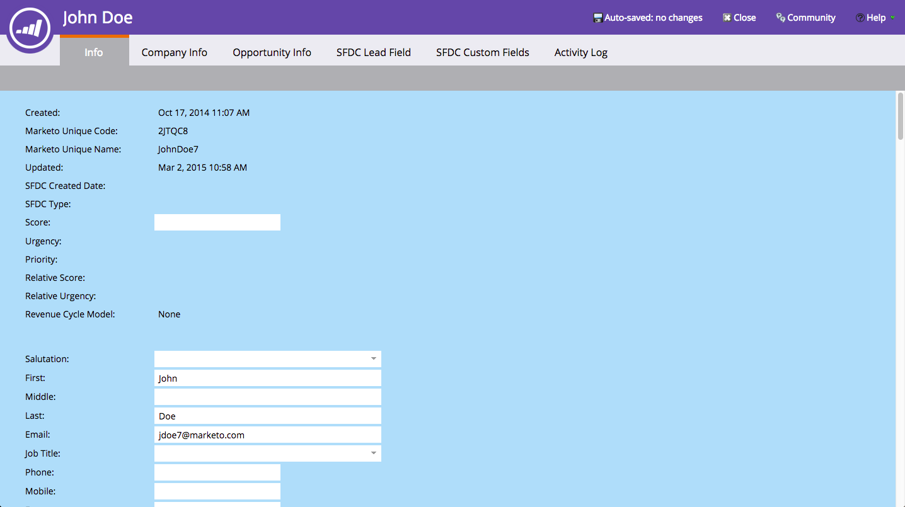
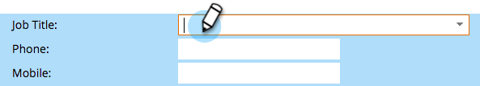

# Använda personinformationssidan {#using-the-person-detail-page}

Personinformationssidan innehåller all information som Marketo känner till om en person. Du kan redigera data direkt från den här sidan.

## Komma till personinformationssidan {#getting-to-person-detail-page}

Det finns många sätt att öppna specifika personer. Några exempel är:

* I **databasen** kan du söka i Snabbsökning
* Valfri **smart lista** eller lista
* Fliken **Medlemmar** i ett program
* **Visa kampanjmedlemmar** i en smart kampanj
* Vissa **rapporter**
    

1. Dubbelklicka på en person eller klicka en gång på ID:t till vänster.

   

1. Detta öppnar skärmen för personinformation.

   

## Sidorganisation - Salesforce {#page-organization-salesforce}

Personinformation kategoriseras på följande flikar:

| Tabb | Beskrivning |
|---|---|
| Info | Kontaktinformation och anpassade fält om en person. |
| Företagsinformation | Personens företagsinformation och adress. |
| Information om affärsmöjlighet | Information om affärsmöjlighet synkroniserad från Salesforce. |
| SFDC Lead Field | Inbyggda Salesforce-fält. |
| Anpassat fält för SFDC | Anpassade Salesforce-fält. |
| Aktivitetslogg | Alla aktiviteter som rör personen. |

## Sidorganisation - Microsoft Dynamics {#page-organization-microsoft-dynamics}

| Tabb | Beskrivning |
|---|---|
| Info | Kontaktinformation och anpassade fält om en person. |
| Företagsinformation | Personens företagsinformation och adress. |
| Information om affärsmöjlighet | Information om affärsmöjlighet synkroniserad från Microsoft. |
| Microsoft anpassade fält | Anpassade Microsoft-fält. |
| Microsoft Lead Field | Inbyggda Microsoft-fält. |
| Aktivitetslogg | Alla aktiviteter som rör personen. |

>[!NOTE]
>
>Du kan också se säljprojektsinformationen [infogad via API](https://experienceleague.adobe.com/en/docs/marketo-developer/marketo/rest/lead-database/opportunities) för instanser som inte har synkroniserats med en CRM.

## Redigera ett fält {#editing-a-field}

Många fält kan redigeras. Om du vill uppdatera en persons information skriver du in ett nytt värde och klickar utanför fältet för att spara.

## Marketo-standardfält före CRM-synkronisering {#marketo-default-fields-prior-to-crm-sync}

|   |  |  |  |  |
|---|---|---|---|---|
| Adress | Årlig intäkt | Anonym IP | Faktureringsadress | Faktureringsort |
| Faktureringsland | Faktureringspostnummer | Faktureringsstat | Ort | Företagets namn |
| Land | Skapad den | Födelsedatum | Avdelning | Ring inte |
| Anropa inte orsak | Orsak till ring inte | E-postadress | Ogiltig e-postadress | Ogiltig e-postorsak |
| ID för externt företag | ID för extern säljare | Faxnummer | Förnamn | Fullständigt namn |
| Bransch | Inaktuell ort | Berört företag | Berört land | Ingående metropolitområde |
| Riktnummer för inkommande telefon | Infört postnummer | Ingångsregion | Är anonym | Är kund |
| Är partner | Befattning | Efternamn | Klassificering | Poäng |
| Person Source | Status | Telefon | Visningsnamn för Marketo Social [!DNL Facebook] | Marketo Social [!DNL Facebook]-ID |
| Marketo Social [!DNL Facebook] Photo URL | Profil-URL för Marketo Social [!DNL Facebook] | Marketo Social [!DNL Facebook] - räckvidd | Marketo Social [!DNL Facebook] - refererade registreringar | Refererade Marketo Social [!DNL Facebook]-besök |
| Marketo Social Genus | Marketo Social, senast refererad registrering | Marketo Social, senaste refererat besök | Visningsnamn för Marketo Social [!DNL LinkedIn] | Marketo Social [!DNL LinkedIn]-ID |
| Marketo Social [!DNL LinkedIn] Photo URL | Profil-URL för Marketo Social [!DNL LinkedIn] | Marketo Social [!DNL LinkedIn] - räckvidd | Marketo Social [!DNL LinkedIn] - refererade registreringar | Refererade Marketo Social [!DNL LinkedIn]-besök |
| Marketo Social Syndication ID | Marketo Social, totalt antal refererade registreringar | Marketo Social, totalt antal refererade besök | Visningsnamn för Marketo Social [!DNL Twitter] | Marketo Social [!DNL Twitter]-ID |
| Marketo Social [!DNL Twitter] Photo URL | Profil-URL för Marketo Social [!DNL Twitter] | Marketo Social [!DNL Twitter] - räckvidd | Marketo Social [!DNL Twitter] - refererade registreringar | Refererade Marketo Social [!DNL Twitter]-besök |
| Mellannamn | Mobiltelefon | Antal anställda | Telefonnummer | Postnummer |
| Prioritet | Relativa poäng | Roll | Titel | SNI-kod |
| Plats | Stat | Avprenumererad | Orsak till avprenumeration | Uppdaterat den |
| Akut | Webbplats |  |  |  |

>[!NOTE]
>
>Vissa fält kan _inte_ redigeras:
>
>* Aktivitetslogg
>* Företagsinformation
>* Möjligheter för SFDC-kontakter
>* Vissa Marketo-specifika fält, t.ex. Skapad och Ursprunglig Source-typ.
>
>Läs mer om [Systemhanterade fält](/help/marketo/product-docs/administration/field-management/understanding-system-managed-fields.md){target="_blank"}.

>[!MORELIKETHIS]
>
>[Skapar en anpassad flik för personinformationssidan](/help/marketo/product-docs/administration/settings/creating-a-custom-tab-for-the-person-detail-page.md){target="_blank"}
