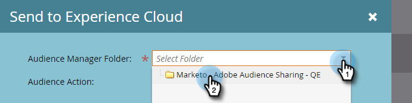

# Exportera en statisk lista till Adobe Experience Cloud {#export-a-static-list-to-adobe-experience-cloud}

>[!NOTE]
>
>En HIPAA-klar distribution av en Marketo-instans kan inte använda den här funktionen.

>[!PREREQUISITES]
>
>[Konfigurera Adobe Experience Cloud målgruppsdelning](http://docs.marketo.com/x/D4GMAg)

## Målprogram som stöds {#supported-destination-applications}

* Adobe Advertising Cloud
* Adobe Analytics (**endast** om du äger en Adobe Audience Manager-licens)
* Adobe Audience Manager
* Adobe Experience Manager
* Adobe Real-Time Customer Data Platform
* Adobe Target

## Exportera en lista {#how-to-export-a-list}

1. I Marketo söker du efter och markerar den lista som du vill exportera.

   

1. Klicka på listrutan **Liståtgärder** och välj **Skicka till Experience Cloud**.

   

1. Klicka på listrutan **Audience Manager-mapp** och markera önskad målmapp i Experience Cloud.

   

1. Välj om du vill skapa en ny målgrupp eller skriva över en befintlig (i det här exemplet skapar vi en ny). Ange det nya målgruppsnamnet och klicka på **Skicka**.

   

1. Klicka på **OK**.

   

   >[!NOTE]
   >
   >Det kan ta upp till 6-8 timmar för publiken att bli fullt utnyttjad i Adobe.

## Saker att notera {#things-to-note}

**Dela till Adobe Analytics**

För kunder som äger både Adobe Audience Manager och Adobe Analytics kommer integreringen att göra det möjligt att dela målgrupper från Marketo till dina Adobe Analytics Report Suites, men det finns några ytterligare konfigurationsåtgärder som måste vidtas i Adobe Audience Manager för att detta ska vara möjligt. Läs Adobe Audience Manager dokumentation om du vill veta mer om hur du konfigurerar detta: [https://docs.adobe.com/content/help/en/analytics/integration/audience-analytics/mc-audiences-aam.html](http://docs.adobe.com/content/help/en/analytics/integration/audience-analytics/mc-audiences-aam.html).

**Trait Usage för Adobe Audience Manager-kunder**

När du initierar en listexport i Marketo kommer du att märka följande ändringar i din Adobe Audience Manager-instans:

* För alla leads i den exporterade listan kommer Marketo att skriva ett spår med Leads hash-kodade e-postmeddelanden som en enhetsidentifierare. Namnet på egenskapen matchar målpublikens namn som du angav under exporten.
* För alla ECID:n som Marketo har lyckats matcha med Leads i den exporterade listan skriver Marketo ett varumärke med ECID-enhetsidentifieraren. Namnet på egenskapen matchar målpublikens namn som du angav under exporten.
* Marketo kommer också att skapa ett segment i din Audience Manager Instance med ECID-egenskapen som enda segmenteringskriterium. Segmentets namn matchar målpublikens namn som du angav under exporten.

## Vanliga frågor {#faq}

**Varför skiljer sig liststorleken i Marketo från den i Adobe?**

Under huven fungerar målgruppsintegreringen genom att synkronisera Marketo Munchkin-cookies med motsvarande Adobe ECID-cookie. Marketo kan bara dela medlemskapsdata för leads som Marketo har synkroniserat ett ECID för. För att få bästa möjliga resultat rekommenderar vi att du läser in Marketos munchkin.js tracking-skript parallellt med Adobe’s visitor.js tracking-kod på alla sidor som du är intresserad av att spåra i marknadsföringssyfte.

**Hur fungerar cookie-synkroniseringen?**

När cookie-synkroniseringen är aktiverad för din Marketo-prenumeration försöker Marketos munchkin.js att hämta och lagra ECID:n för Adobe för den Adobe IMS-organisation som du angav under integreringsinställningen och matcha dessa ECID:n med motsvarande Marketo-cookie-identifierare. Detta gör att Marketos anonyma användarprofiler kan berikas med Adobe ECID:n.

Ytterligare ett steg krävs för att koppla den anonyma användarprofilen till en lead-profil, som identifieras med ett enkelt textmeddelande. Exakt hur detta fungerar beskrivs här: [https://docs.marketo.com/display/public/DOCS/Tracking+Anonymous+Activity+and+People](http://docs.marketo.com/display/public/DOCS/Tracking+Anonymous+Activity+and+People).
