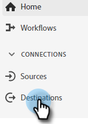

# Överför ett Adobe Experience Cloud-segment till en Marketo Static List {#push-an-adobe-experience-cloud-segment-to-a-marketo-static-list}

Med den här funktionen kan du överföra segment som finns i din Adobe Experience Platform till Marketo i form av en statisk lista.

>[!PREREQUISITES]
>
>* [Skapa en API-](/help/marketo/product-docs/administration/users-and-roles/create-an-api-only-user.md) användare i Marketo.
>* Gå sedan till **Admin** > **Startpunkt**. Leta reda på namnet på den roll du just skapade och klicka på **Visa detaljer**. Kopiera och spara informationen i **Klient-ID** och **Klienthemlighet** så som du behöver den för den här funktionen.

1. Logga in på [Adobe Experience Platform](https://experience.adobe.com/).

   

1. Klicka på rutnätsikonen och välj **Experience Platform**.

   

1. Klicka på **Destinationer** i det vänstra nav.

   

1. Klicka på **Katalog**.

   

1. Hitta plattan Marketo Engage och klicka på **Aktivera**.

   

1. Klicka på alternativknappen **Nytt konto** under Kontotyp. Ange dina Marketo-inloggningsuppgifter och klicka på **Anslut till mål**.

   

   >[!NOTE]
   >
   >Du kan hitta ditt Munchkin-ID genom att gå till **Admin** > **Munchkin** (det är också en del av din Marketo-URL när du har loggat in). Klient-ID/hemlighet som du bör ha från att följa de krav som anges högst upp i den här artikeln.

1. &quot;Ansluten&quot; ska visas under dina autentiseringsuppgifter. Klicka på **Nästa** i det övre högra hörnet.

   

1. Ange ett **namn** och en _valfri_ beskrivning. Klicka på **Skapa mål**.

   >[!NOTE]
   >
   >Det är också valfritt att välja något från Marknadsföringsåtgärder. Marketo utnyttjar inte den informationen just nu, men kommer troligen snart.

   

1. Klicka på **Nästa**.

   

1. Välj önskat segment och klicka på **Nästa**.

   

   >[!NOTE]
   >
   >Segmenten i statiska listor är 1:1. Om du väljer flera segment här måste du mappa varje segment till en angiven statisk lista på fliken Segmentschema.

1. Klicka på **Lägg till ny mappning**.

   

1. Klicka på markörikonen.

   

1. Välj det relevanta fält som innehåller den e-postadress som identifierar användaren. Klicka på **Välj** när du är klar.

   

   

   >[!NOTE]
   >
   >Exemplet som vi har valt kan se mycket annorlunda ut än det du valt.

1. Klicka på mappningsikonen.

   

1. Välj målfält och klicka på **Välj**.

   

1. Klicka på **Nästa**.

   

1. _Skapa en statisk lista i Marketo_ eller sök efter och välj en som du redan har skapat. Kopiera mappnings-ID:t från slutet av URL:en.

   

   >[!NOTE]
   >
   >För bästa resultat bör du se till att den lista du refererar till i Marketo är tom.

1. I Adobe Experience Platform anger du det ID du just kopierade. Välj startdatum. Människor synkroniseras kontinuerligt till det valda slutdatumet. Lämna slutdatumet tomt om du vill synkronisera oändligt. Klicka på **Nästa** när du är klar.

   

1. Bekräfta ändringarna och klicka på **Slutför**.

   
