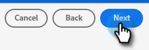

# Överför ett Adobe Experience Platform-segment till en Marketo Static List {#push-an-adobe-experience-platform-segment-to-a-marketo-static-list}

Med den här funktionen kan du överföra segment som finns i din Adobe Experience Platform till Marketo i form av en statisk lista.

>[!PREREQUISITES]
>
>* [Redigera API-rollen](/help/marketo/product-docs/administration/users-and-roles/create-delete-edit-and-change-a-user-role.md#edit-an-existing-role) för att säkerställa att den har **Skrivskyddad person** behörighet (finns i listrutan Åtkomst-API).
>* [Skapa en API-användare](/help/marketo/product-docs/administration/users-and-roles/create-an-api-only-user.md) i Marketo.
>* Gå till **Administratör** > **Startpunkt**. Sök efter namnet på den roll du just skapade och klicka på **Visa detaljer**. Kopiera och spara informationen i **Klient-ID** och **Klienthemlighet** som du kunde behöva det för steg 7.
>* Skapa en statisk lista i Marketo eller sök efter och välj en som du redan har skapat. Du behöver dess ID.

1. Logga in på [Adobe Experience Platform](https://experience.adobe.com/).

   

1. Klicka på rutnätsikonen och välj **Experience Platform**.

   

1. Klicka på **Destinationer**.

   

1. Klicka **Katalog**.

   

1. Hitta plattan Marketo Engage och klicka **Aktivera**.

   

1. Klicka **Konfigurera nytt mål**.

   

1. Under Kontotyp väljer du alternativknappen Befintligt eller Nytt konto (i det här exemplet väljer vi **Befintligt konto**). Klicka på ikonen Välj konto.

   

   >[!NOTE]
   >
   >Om du väljer Nytt konto kan du hitta ditt Munchkin-ID genom att gå till **Administratör** > **Munchkin** (den ingår också i din Marketo-URL när du har loggat in). Klient-ID/hemlighet som du bör ha från att följa de krav som anges högst upp i den här artikeln.

1. Välj målkonto och klicka på **Välj**.

   

1. Ange ett mål **Namn** och en valfri beskrivning. Klicka på listrutan Skapa person och välj&quot;Matcha befintliga Marketo-personer och skapa saknade personer i Marketo&quot; _eller_ &quot;Matcha endast befintliga Marketo-användare&quot; (i det här exemplet väljer vi den första). Du måste också välja en **Arbetsyta**.

   

   >[!NOTE]
   >
   >Om du väljer&quot;Matcha endast befintliga Marketo-användare&quot; behöver du bara mappa e-postmeddelandet och/eller ECID så att du kan hoppa över steg 13-16.

1. Det här avsnittet är valfritt. Klicka **Skapa** att hoppa över.

   

1. Markera målet som du skapade och klicka på **Nästa**.

   

1. Välj det segment som du vill skicka till Marketo och klicka på **Nästa**.

   

   >[!NOTE]
   >
   >Om du väljer flera segment måste du mappa varje segment till en angiven statisk lista på fliken Segmentschema.

   >[!IMPORTANT]
   >
   >När ett segment har aktiverats för första gången på Marketo-målet kan de bakåtfyllnadsprofiler som redan fanns i segmentet innan Marketo-målaktiveringen aktiveras **upp till 24 timmar**. Framöver kommer profiler som läggs till i segmentet att läggas till i Marketo direkt.

1. Klicka **Lägg till ny mappning**.

   

1. Klicka på mappningsikonen.

   

1. Välj önskade attribut och klicka på **Välj**. I det här exemplet väljer vi förnamn, efternamn och e-postadress.

   

   >[!NOTE]
   >
   >Du kan mappa attribut från Experience Platform till attribut som din organisation har åtkomst till i Marketo Engage. Använd [Beskriv API-begäran](https://developers.marketo.com/rest-api/lead-database/leads/#describe){target="_blank"} för att hämta attributfält som din organisation har åtkomst till.

1. Mappa efternamn och företagsnamn genom att klicka på **Lägg till ny mappning** och upprepa steg 15 två gånger genom att välja **lastName** och sedan **companyName**.

   

1. Nu är det dags att mappa e-postadressen. Klicka **Lägg till ny mappning** igen.

   

1. Klicka på mappningsikonen.

   

1. Klicka på alternativknappen Välj identitetsnamnområde och välj  **E-post** och sedan klicka **Välj**.

   

   >[!IMPORTANT]
   >
   >Mappa e-post och/eller ECID från **Identitetsnamnutrymme** -fliken är det viktigaste att göra för att säkerställa att personen matchas i Marketo. Mappning via e-post ger högsta matchningsfrekvens.

1. Nu är det dags att välja källfälten. Klicka på markörikonen för e-post.

   

1. Klicka på alternativknappen Välj identitetsnamnutrymme, sök efter och markera **E-post** och sedan klicka **Välj**.

   

1. Om du vill välja källfältet för företagsnamnet klickar du på markörikonen på raden.

   

1. Låt alternativknappen Välj attribut vara markerad. Sök efter&quot;företag&quot; och välj **companyName** och sedan klicka **Välj**.

   

1. Mappa källfälten för Efternamn och Förnamn genom att klicka på markörikonen för varje och upprepa steg 23 två gånger. Välj **lastName** och sedan **firstName**.

   

1. Klicka **Nästa**.

   

1. Granska ändringarna och klicka på **Slutför**.

   
