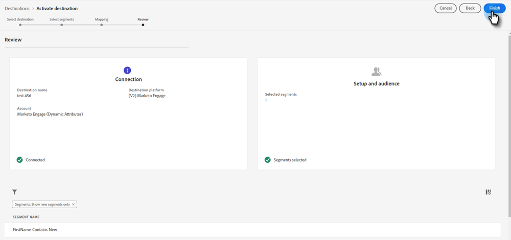

# Överför ett Adobe Experience Platform-segment till en Marketo Static List {#push-an-adobe-experience-platform-segment-to-a-marketo-static-list}

Med den här funktionen kan du överföra segment som finns i din Adobe Experience Platform till Marketo Engage i form av en statisk lista.

>[!PREREQUISITES]
>
>* [Redigera API-rollen](/help/marketo/product-docs/administration/users-and-roles/create-delete-edit-and-change-a-user-role.md#edit-an-existing-role){target="_blank"} och kontrollera att den har behörigheten **Read-Write Person** (finns i listrutan Åtkomst-API).
>* [Skapa en API-användare](/help/marketo/product-docs/administration/users-and-roles/create-an-api-only-user.md){target="_blank"} i Marketo.
>* Gå till **[!UICONTROL Admin]** > **[!UICONTROL Launchpoint]**. Sök efter namnet på rollen som du just skapade och klicka på **[!UICONTROL View Details]**. Kopiera och spara informationen i **[!UICONTROL Client ID]** och **[!UICONTROL Client Secret]**, eftersom du kan behöva den för steg 7.
>* Skapa en statisk lista i Marketo eller sök efter och välj en som du redan har skapat. Du behöver dess ID.

1. Logga in på [Adobe Experience Platform](https://experience.adobe.com/){target="_blank"}.

   

1. Klicka på rutnätsikonen och välj **[!UICONTROL Experience Platform]**.

   

1. Klicka på **[!UICONTROL Destinations]** i den vänstra navigeringen.

   

1. Klicka på **[!UICONTROL Catalog]**.

   

1. Hitta Marketo Engage-rutan och klicka på **[!UICONTROL Activate]**.

   

1. Klicka på **[!UICONTROL Configure New Destination]**.

   

1. Under Kontotyp väljer du alternativknappen Befintligt eller Nytt konto (i det här exemplet väljer vi **[!UICONTROL Existing Account]**). Klicka på ikonen Välj konto.

   

   >[!NOTE]
   >
   >Om du väljer Nytt konto kan du hitta ditt Munchkin-ID genom att gå till **[!UICONTROL Admin]** > **[!UICONTROL Munchkin]** (det är också en del av din Marketo-URL när du har loggat in). Klient-ID/hemlighet som du bör ha från att följa de krav som anges högst upp i den här artikeln.

1. Välj målkontot och klicka på **[!UICONTROL Select]**.

   

1. Ange ett mål **[!UICONTROL Name]** och en valfri beskrivning. Klicka på listrutan Skapa person och välj Matcha befintliga Marketo-personer och Skapa saknade personer i Marketo _eller_ Matcha endast befintliga Marketo-personer (i det här exemplet väljer vi den första). Du måste också välja en **[!UICONTROL Workspace]**.

   

   >[!NOTE]
   >
   >Om du väljer [!UICONTROL Match Existing Marketo People Only] behöver du bara mappa e-postadressen och/eller ECID, så du kan hoppa över steg 13-16.

1. Det här avsnittet är valfritt. Klicka på **[!UICONTROL Create]** om du vill hoppa över.

   

1. Markera målet som du skapade och klicka på **[!UICONTROL Next]**.

   

1. Välj det segment som du vill skicka till Marketo och klicka på **[!UICONTROL Next]**.

   

   >[!NOTE]
   >
   >Om du väljer flera segment måste du mappa varje segment till en angiven statisk lista på fliken [!UICONTROL Segment Schedule].

   >[!IMPORTANT]
   >
   >När ett segment har aktiverats för första gången på Marketo-målet kan det ta _upp till 24 timmar_ att fylla i profiler som redan fanns i segmentet innan Marketo-målaktiveringen. Framöver kommer profiler som läggs till i segmentet att läggas till i Marketo direkt.

1. Klicka på **[!UICONTROL Add New Mapping]**.

   

1. Klicka på mappningsikonen.

   

1. Välj önskade attribut och klicka på **[!UICONTROL Select]**. I det här exemplet väljer vi förnamn, efternamn och e-postadress.

   

   >[!NOTE]
   >
   >Du kan mappa attribut från Experience Platform till alla attribut som din organisation har tillgång till i Marketo Engage. Använd [Beskriv API-begäran](https://experienceleague.adobe.com/sv/docs/marketo-developer/marketo/rest/lead-database/lead-database#describe){target="_blank"} för att hämta attributfält som din organisation har åtkomst till.

1. Mappa efternamn och företagsnamn genom att klicka på **[!UICONTROL Add New Mapping]** igen och upprepa steg 15 två gånger. Välj **[!UICONTROL lastName]** och sedan **[!UICONTROL companyName]**.

   

1. Nu är det dags att mappa e-postadressen. Klicka på **[!UICONTROL Add New Mapping]** igen.

   

1. Klicka på mappningsikonen.

   

1. Klicka på alternativknappen Välj identitetsnamnområde, välj **[!UICONTROL Email]** och klicka sedan på **[!UICONTROL Select]**.

   

   >[!IMPORTANT]
   >
   >Att mappa e-post och/eller ECID från fliken **[!UICONTROL Identity Namespace]** är det viktigaste att göra för att se till att personen matchas i Marketo. Mappning via e-post ger högsta matchningsfrekvens.

1. Nu är det dags att välja källfälten. Klicka på markörikonen för e-post.

   

1. Klicka på alternativknappen Välj identitetsnamnområde, sök efter och markera **[!UICONTROL Email]** och klicka sedan på **[!UICONTROL Select]**.

   

1. Om du vill välja källfältet för företagsnamnet klickar du på markörikonen på raden.

   

1. Låt alternativknappen Välj attribut vara markerad. Sök efter&quot;företag&quot; och välj **[!UICONTROL companyName]** och klicka sedan på **[!UICONTROL Select]**.

   

1. Mappa källfälten för Efternamn och Förnamn genom att klicka på markörikonen för varje och upprepa steg 23 två gånger. Välj **[!UICONTROL lastName]** och sedan **[!UICONTROL firstName]**.

   

1. Klicka på **[!UICONTROL Next]**.

   

1. Granska dina ändringar och klicka på **[!UICONTROL Finish]**.

   
