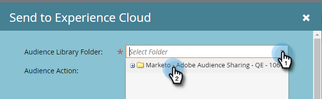

# Skicka en lista till Adobe Experience Cloud {#send-a-list-to-adobe-experience-cloud}

>[!NOTE]
>
>En HIPAA-färdig distribution av en Marketo Engage-instans kan inte använda den här funktionen.

>[!PREREQUISITES]
>
>[Konfigurera organisationsmappning för Adobe](/help/marketo/product-docs/adobe-experience-cloud-integrations/set-up-adobe-organization-mapping.md){target="_blank"}

## Målprogram som stöds {#supported-destination-applications}

* Adobe Advertising Cloud
* Adobe Analytics (_endast_ om du äger en Adobe Audience Manager-licens)
* Adobe Audience Manager
* Adobe Experience Manager
* Adobe Real-time Customer Data Platform
* Adobe Target

## Skicka en statisk lista {#how-to-send-a-static-list}

En statisk lista är bara det, statiskt. Listan i Adobe Experience Cloud ändras inte om du inte gör det manuellt.

1. I Marketo hittar du den lista som du vill exportera. Högerklicka på den och välj **[!UICONTROL Send to Experience Cloud]**.

   

1. Klicka på listrutan **[!UICONTROL Audience Manager Folder]** och välj önskad målmapp i Experience Cloud.

   

1. Välj om du vill skapa en ny målgrupp eller skriva över en befintlig (i det här exemplet skapar vi en ny). Ange det nya publiknamnet och klicka på **[!UICONTROL Send]**.

   

1. Klicka på **[!UICONTROL OK]**.

   

   >[!NOTE]
   >
   >Det kan ta upp till 6-8 timmar för publiken att bli fullt utnyttjad i Adobe.

## Skicka en synkroniserad lista {#how-to-send-a-synced-list}

Synkronisering av en lista innebär att när du uppdaterar en lista i Marketo synkroniseras ändringen automatiskt med målgruppen i Adobe Experience Cloud.

1. I Marketo hittar du den lista som du vill exportera. Högerklicka på den och välj **[!UICONTROL Send to Experience Cloud]**.

   

1. Klicka på listrutan **[!UICONTROL Audience Library Folder]** och välj önskad målmapp i Experience Cloud.

   

1. Välj om du vill skapa en ny målgrupp eller skriva över en befintlig (i det här exemplet skapar vi en ny). Ange det nya målgruppsnamnet, markera rutan **[!UICONTROL Keep Audience Membership in Sync]** och klicka på **[!UICONTROL Send]**.

   

1. Klicka på **OK**.

   

## Stoppa listsynkronisering {#how-to-stop-a-list-sync}

Du kan när som helst stoppa synkroniseringen av listan.

1. I Marketo söker du efter och högerklickar på den lista som du vill sluta synkronisera. Klicka på **[!UICONTROL Stop List Sync]**.

   

1. Markera de målgrupper som du vill sluta synkronisera och klicka på **[!UICONTROL Stop]**.

   

1. Bekräfta genom att klicka på **[!UICONTROL Stop]**.

   

## Saker att notera {#things-to-note}

**Delning till Adobe Analytics**

* För kunder som äger både Adobe Audience Manager och Adobe Analytics kommer denna integrering att göra det möjligt att dela målgrupper från Marketo till Adobe Analytics Report Suites, men det finns några ytterligare konfigurationsåtgärder som måste vidtas i Adobe Audience Manager för att detta ska vara möjligt. Läs [Adobe Audience Manager dokumentation](https://experienceleague.adobe.com/docs/analytics/integration/audience-analytics/mc-audiences-aam.html){target="_blank"} om du vill ha mer information om hur du konfigurerar det här.

* Om en lista är tom, eller om det inte finns några personer med ECID-värden, skickas listnamnet inte för referens utanför Marketo Engage.

**Trait Usage för Adobe Audience Manager-kunder**

När du initierar en listexport i Marketo kommer du att märka att följande ändringar återspeglas i din Adobe Audience Manager-instans:

* För alla personer i den exporterade listan skriver Marketo ett spår med hjälp av sina hash-kodade e-postmeddelanden som en identifierare för olika enheter. Namnet på egenskapen matchar målpublikens namn som du angav under exporten.
* För alla ECID:n som Marketo har lyckats matcha med personerna i den exporterade listan, kommer Marketo att skriva ett spår med ECID-enhetsidentifieraren. Namnet på egenskapen matchar målpublikens namn som du angav under exporten.
* Marketo kommer också att skapa ett segment i din Audience Manager Instance med ECID-egenskapen som det enda segmenteringskriteriet. Segmentets namn matchar målpublikens namn som du angav under exporten.

## Vanliga frågor och svar {#faq}

**Varför skiljer sig liststorleken i Marketo från den i Adobe?**

Under huven fungerar målgruppsintegreringen genom att synkronisera Marketo Munchkin-cookies med motsvarande Adobe ECID-cookie. Marketo kan bara dela medlemskapsdata för personer som Marketo har synkroniserat ett ECID för. För att få bästa möjliga resultat rekommenderar vi att du läser in Marketo munchkin.js-spårningsskript parallellt med spårningskoden för Adobe visitor.js på alla sidor som du är intresserad av att spåra i marknadsföringssyfte.

**Hur fungerar cookie-synkroniseringen?**

När cookie-synkronisering är aktiverat för din Marketo-prenumeration försöker Marketo munchkin.js hämta och lagra ECID:n för Adobe för den Adobe IMS-organisation som du angav under integreringsinställningen och matcha dessa ECID:n med motsvarande Marketo cookie-identifierare. Detta gör att Marketo anonyma användarprofiler kan berikas med ECID:n för Adobe.

Ytterligare ett steg krävs för att koppla den anonyma användarprofilen till en personprofil, som identifieras med ett vanligt textmeddelande. Exakt hur detta fungerar [beskrivs här](/help/marketo/product-docs/reporting/basic-reporting/report-activity/tracking-anonymous-activity-and-people.md){target="_blank"}.

**Vilken information delas?**

Den här integreringen delar bara information om medlemskap från Marketo till Adobe (t.ex. kännedom om att person X är medlem i lista Y). Inga ytterligare personattribut delas till Adobe via den här integreringen.
