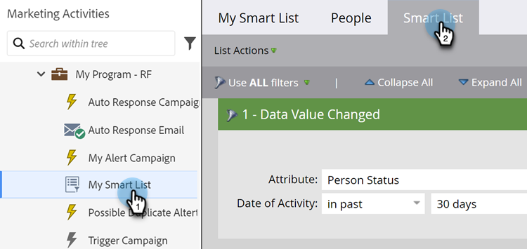
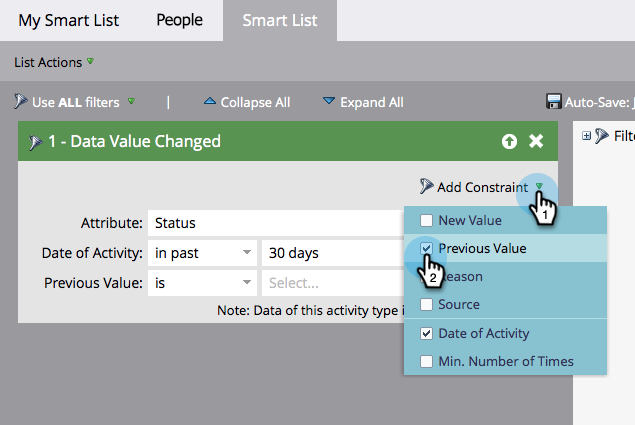

# Lägga till en begränsning i ett smart listfilter {#add-a-constraint-to-a-smart-list-filter}

När du skapar en smart lista har vissa filter avancerade alternativ som kallas &quot;begränsningar&quot;. Det här är extra villkor som du kan lägga till i filter och utlösare för att begränsa sökningen ytterligare.

I det här exemplet lägger vi till begränsningar i ett **[datavärde ändrat](/help/marketo/product-docs/core-marketo-concepts/smart-campaigns/flow-actions/change-data-value.md){target="_blank"}**-filter för att hitta personer som har en statusändring från MQL till SQL.

>[!PREREQUISITES]
>
>* [Skapa en smart lista](/help/marketo/product-docs/core-marketo-concepts/smart-lists-and-static-lists/creating-a-smart-list/create-a-smart-list.md){target="_blank"}
>* [Använd filtret&quot;Datavärdet har ändrats&quot; i en smart lista](/help/marketo/product-docs/core-marketo-concepts/smart-lists-and-static-lists/using-smart-lists/use-the-data-value-changed-filter-in-a-smart-list.md){target="_blank"}

1. Gå till **[!UICONTROL Marketing Activities]**.

   

1. Markera den smarta listan med ett filter som du lägger till en begränsning i och klicka på fliken **[!UICONTROL Smart List]**.

   

1. Välj **[!UICONTROL Previous Value]** under **[!UICONTROL Add Constraint]**.

   

1. Ange **[!UICONTROL Previous Value]**. I det här exemplet använder vi MQL.

   

1. Välj **[!UICONTROL New Value]** under **[!UICONTROL Add Constraint]**.

   

1. Ange det nya värdet. I det här exemplet använder vi SQL.

   

1. Snyggt gjort! Klicka på fliken **[!UICONTROL People]** för att visa alla personer som har haft en statusändring från MQL till SQL under de senaste 30 dagarna.
