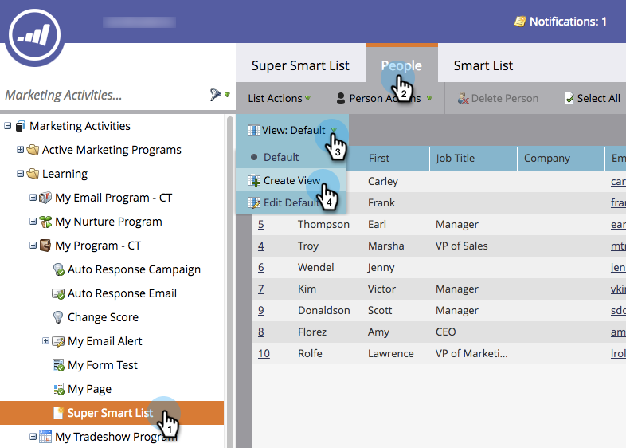

# Skapa och ändra vyer för listor och smarta listor {#create-and-change-views-for-lists-and-smart-list}

En smart lista visar en standarduppsättning med kolumner. Visste du att du kunde redigera kolumnerna efter ditt hjärtas innehåll? Så här gör du.

## Skapa en vy {#create-a-view}

1. Gå till en lista eller smart lista, klicka på fliken **Personer** och klicka på **Skapa** **vy** i **listrutan Visa** .
1. 

1. Namnge vyn och hitta den kolumn som du vill lägga till eller ta bort.

   

   Lägg till/ta bort kolumner och klicka sedan på Skapa.

   

>[!TIP]
>
>Använd rutan **Sök** om du snabbt vill söka.

## Växla vy {#switch-views}

1. Klicka på listrutan **Visa** och välj sedan önskad vy. Växla fram och tillbaka mellan vyer efter behov.

   

>[!NOTE]
>
> Du måste först skapa en andra vy, förutom standardvyn, för att kunna växla mellan vyer.

## Redigera en vy {#edit-a-view}

1. Kontrollera att den vy du vill redigera är markerad i listrutan **Visa** .

   

1. Klicka på alternativet **Redigera** .

   

1. Gör önskade ändringar och klicka på **Spara**.

   

## Ta bort en vy {#delete-a-view}

1. Välj alternativet **Redigera** för den vy som du vill ta bort från listrutan **Visa** .

   

1. Klicka på **Ta bort**.

   

Det är bara du som kan se de anpassade vyer du skapar i listrutan Visa, så tala om för dina vänner att de behöver skapa egna vyer!

>[!NOTE]
>
>**Relaterade artiklar**
>
>* [Använd inbyggda/systemsmarta listor](use-built-in-system-smart-lists.md)
>* [Skapa en smart lista](../../../../product-docs/core-marketo-concepts/smart-lists-and-static-lists/creating-a-smart-list/create-a-smart-list.md)

>

