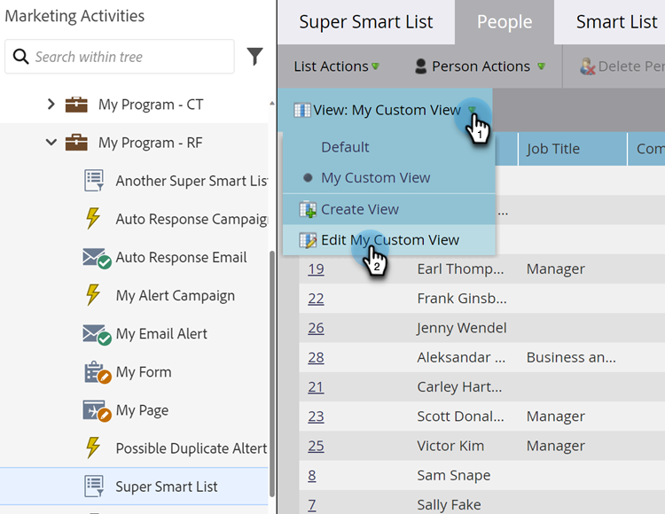

# Skapa och ändra vyer för listor och smarta listor {#create-and-change-views-for-lists-and-smart-list}

En smart lista visar en standarduppsättning med kolumner. Visste du att du kunde redigera kolumnerna efter ditt hjärtas innehåll? Så här gör du.

## Skapa en vy {#create-a-view}

1. Gå till en lista eller Smart List, klicka på fliken **[!UICONTROL People]** och klicka på **[!UICONTROL Create View]** under listrutan **[!UICONTROL View]**.

   

1. Namnge vyn och hitta den kolumn som du vill lägga till eller ta bort.

   

1. Lägg till/ta bort de kolumner du vill använda och klicka sedan på **[!UICONTROL Create]**.

   

>[!TIP]
>
>Använd rutan **[!UICONTROL Find]** om du snabbt vill söka.

## Växla vy {#switch-views}

1. Klicka på listrutan **[!UICONTROL View]** och välj sedan önskad vy. Växla fram och tillbaka mellan vyer efter behov.

   

>[!NOTE]
>
> Du måste först skapa en andra vy, förutom standardvyn, för att kunna växla mellan vyer.

## Redigera en vy {#edit-a-view}

1. Kontrollera att vyn som du vill redigera är markerad i listrutan **[!UICONTROL View]**.

   

1. Klicka på alternativet **[!UICONTROL Edit]**.

   

1. Gör önskade ändringar och klicka på **[!UICONTROL Save]**.

   

## Ta bort en vy {#delete-a-view}

1. Välj alternativet **[!UICONTROL Edit]** för den vy som du vill ta bort från listrutan **[!UICONTROL View]**.

   

1. Klicka på **[!UICONTROL Delete]**.

   

Det är bara du som kan se de anpassade vyer du skapar i listrutan Visa, så tala om för dina vänner att de behöver skapa egna vyer!

>[!MORELIKETHIS]
>
>* [Använd inbyggda/systemsmarta listor](/help/marketo/product-docs/core-marketo-concepts/smart-lists-and-static-lists/using-smart-lists/use-built-in-system-smart-lists.md){target="_blank"}
>* [Skapa en smart lista](/help/marketo/product-docs/core-marketo-concepts/smart-lists-and-static-lists/creating-a-smart-list/create-a-smart-list.md){target="_blank"}
