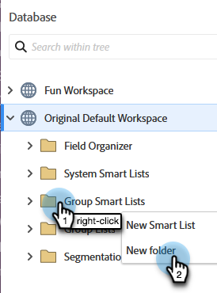

# Referera till en lista eller en smart lista över arbetsytor {#reference-a-list-or-smart-list-across-workspaces}

Listor och smarta listor kan delas och refereras till mellan arbetsytor för enkel återanvändning från databasen.

>[!NOTE]
>
>Personpartitionsregler gäller (smarta listor och statiska listor i en arbetsyta visar bara personer som är både medlemmar i listan _och_ medlemmar i den aktuella arbetsytan).

## Dela en lista eller smart lista {#share-a-list-or-smart-list}

1. Gå till **[!UICONTROL Database]**.

   

1. Högerklicka på en kampanjmapp. Välj **[!UICONTROL New Folder]**.

   

   >[!NOTE]
   >
   >Assets kan bara delas mellan arbetsytor om de är kapslade i en mapp.

1. Namnge mappen och klicka på **[!UICONTROL Create]**.

   

1. Dra och släpp en lista eller smart lista som du vill dela till den nya mappen.

   

1. Högerklicka på den nya mappen och välj **[!UICONTROL Share folder]**.

   

1. Välj en **[!UICONTROL Workspace]** att dela med och klicka på **[!UICONTROL Save]**.

   

   Häftig! Den här listan kommer nu att vara tillgänglig på båda arbetsytorna.

   >[!NOTE]
   >
   >I marknadsföringsaktiviteter kan du bara dela mappar på den översta nivån. I Databas kan du dela mappar på den översta nivån samt en nivå ned.
