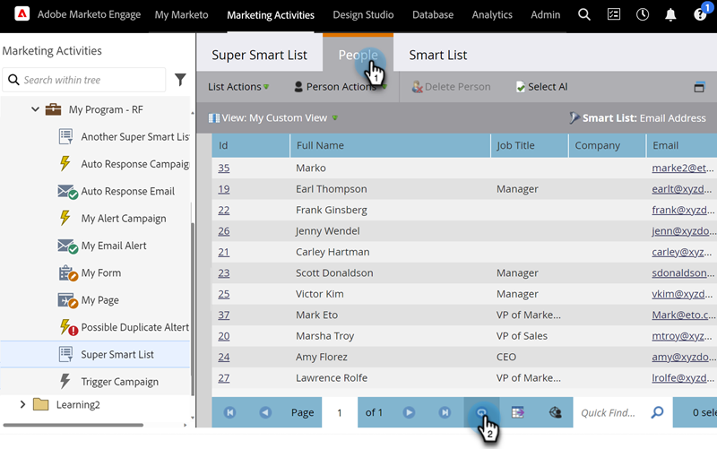

# Uppdatera en lista eller smart lista {#refresh-a-list-or-smart-list}

Om du har kört en smart lista och några minuter har gått kan resultatet bli annorlunda nu - uppdatera för att ta reda på det.

## Uppdatera resultat {#refresh-results}

1. Om du vill uppdatera data på fliken **[!UICONTROL People]** i en smart lista klickar du på ikonen Uppdatera.

   

1. Den smarta listan kör om och visar en mer aktuell resultatuppsättning.

   

>[!TIP]
>
>Ibland när du kör en smart lista och kommer tillbaka till den senare, kan du se ordet&quot;Om&quot; framför personen i det nedre högra hörnet. Detta anger att talet är ungefärligt - klicka på själva talet för att uppdatera det och få ett uppdaterat, korrekt antal.

>[!MORELIKETHIS]
>
>[Exportera personer till Excel från en lista eller smart lista](/help/marketo/product-docs/core-marketo-concepts/smart-lists-and-static-lists/managing-people-in-smart-lists/export-people-to-excel-from-a-list-or-smart-list.md){target="_blank"}
