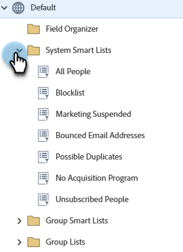

# Använd inbyggda/systemsmarta listor {#use-built-in-system-smart-lists}

Marketo Engage har några mycket användbara inbyggda smarta listor. Vi kollar dem!

1. Gå till **[!UICONTROL Database]**.

   

1. Öppna mappen **[!UICONTROL System Smart Lists]** för att visa samlingen.

   

1. Så här ser du ett exempel: Välj **[!UICONTROL All People]** och klicka sedan på fliken **[!UICONTROL People]**.

   

   >[!NOTE]
   >
   >Filtren i Systemets smarta listor behöver inte tillämpas på varje smart lista/kampanj. Innehållet i dem känns igen automatiskt.

Här följer en sammanfattning av vad de inbyggda smarta listorna gör:

<table><thead>
  <tr>
    <th>Listnamn</th>
    <th>Beskrivning</th>
  </tr></thead>
<tbody>
  <tr>
    <td>Alla personer</td>
    <td>Alla personer i din Marketo-databas</td>
  </tr>
  <tr>
    <td>Avbeställ</td>
    <td>Dessa personer kan endast skickas operativa e-postmeddelanden. Detta styrs vanligtvis av personen själv.</td>
  </tr>
  <tr>
    <td>Marknadsföring har pausats</td>
    <td>Dessa personer kan bara skickas operativa e-postmeddelanden. Detta styrs vanligtvis av dig, marknadsföraren.</td>
  </tr>
  <tr>
    <td>Blockeringslista</td>
    <td>De här personerna kommer inte att få något e-postmeddelande alls.</td>
  </tr>
  <tr>
    <td>Avrundade e-postadresser</td>
    <td>Personer med en olevererbar e-postadress eller som avvisar din e-postadress.</td>
  </tr>
  <tr>
    <td>Möjliga dubbletter</td>
    <td>Personer som kan vara duplicerade i Marketo-databasen.</td>
  </tr>
</tbody>
</table>

>[!NOTE]
>
>Det går inte att ta bort smarta systemlistor. Med undantag för listan Möjliga dubbletter kan de inte heller redigeras.

>[!MORELIKETHIS]
>
>[Skapa en smart lista](/help/marketo/product-docs/core-marketo-concepts/smart-lists-and-static-lists/creating-a-smart-list/create-a-smart-list.md){target="_blank"}
