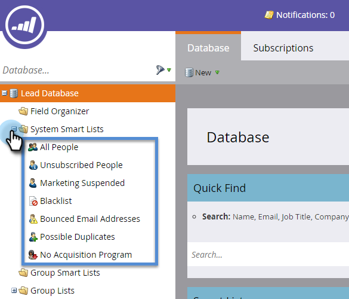

# Använd inbyggda/systemsmarta listor {#use-built-in-system-smart-lists}

Marketo har några mycket användbara inbyggda smarta listor. Vi kollar dem!

>[!NOTE]
>
>Marketo håller på att ändra termer som Blacklist och Whitelist för att Blocklist och Tillåtslista i vår produkt. Under den här uppdateringen kan du se de gamla villkoren i våra användargränssnitt och skärmbilder för dokumentation samt de nya villkoren i vår dokumentationstext. Vi ber om ursäkt för all förvirring.

1. Gå till databasen***.

   

1. Öppna mappen **System Smart Lists** för att visa samlingen.

   

1. Så här ser du ett exempel: Markera **Alla personer** och klicka sedan på fliken **Personer** .

   

   >[!NOTE]
   >
   >Filtren i systemsmarta listor behöver inte tillämpas på varje smart lista/kampanj. Deras innehåll känns igen automatiskt.

   | Listnamn | Beskrivning |
   |---|---|
   | Alla personer | Alla personer i Marketo-databasen |
   | Avbeställ | Dessa personer kan endast få operativa e-postmeddelanden; Detta kontrolleras vanligtvis av personen själv. |
   | Marknadsföring har pausats | Dessa personer kan endast få operativa e-postmeddelanden; Detta kontrolleras vanligtvis av dig, marknadsföraren. |
   | Blockeringslista | De här personerna kommer inte att få något e-postmeddelande alls. |
   | Avrundade e-postadresser | Personer med en olevererbar e-postadress eller som avvisar din e-postadress. |
   | Möjliga dubbletter | Personer som kan vara duplicerade i Marketo-databasen. |

Här följer en sammanfattning av vad de inbyggda smarta listorna gör:

>[!NOTE]
>
>Det går inte att ta bort systemsmarta listor. Med undantag för listan Möjliga dubbletter kan de inte heller redigeras.

>[!NOTE]
>
>**Relaterade artiklar**
>
>* [Skapa en smart lista](../../../../product-docs/core-marketo-concepts/smart-lists-and-static-lists/creating-a-smart-list/create-a-smart-list.md)

>

