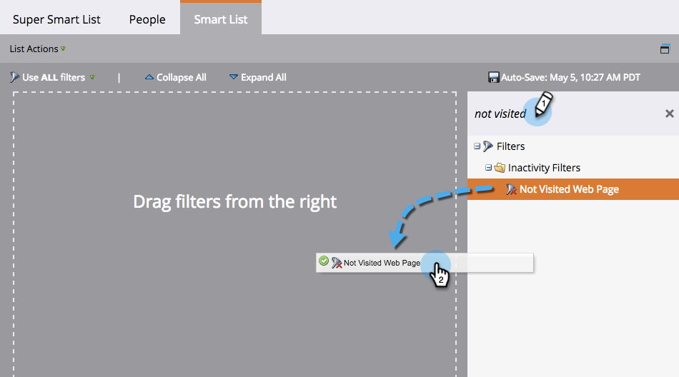

# Använd inaktivitetsfilter i en smart lista {#use-inactivity-filters-in-a-smart-list}

Visste du att du kan leta efter personer i en Smart List som *inte* har gjort något? Kolla in dessa inaktivitetsfilter.

1. Gå till **marknadsföringsaktiviteter**.

   

1. Markera den smarta lista som du vill redigera och klicka sedan på fliken **Smart lista** .

   

1. Hitta och dra valfritt inaktivitetsfilter till arbetsytan. Låt oss till exempel hitta personer som inte har besökt någon av dina sidor.

   

   >[!TIP]
   >
   >Det finns många filter i mappen **Inaktivitetsfilter** . Sök efter **Inte** och checka ut dem.

1. Markera operatorn **är valfri** . Då hittar du alla personer som inte har besökt någon sida de senaste 30 dagarna.

   

   Var inte det enkelt?

