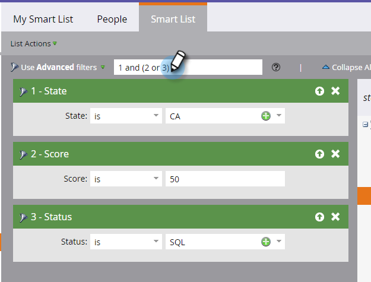

# Använda avancerad logik för smart listregel {#using-advanced-smart-list-rule-logic}

Du kan hitta exakt de personer du behöver genom att tillämpa logik för smarta listregler på flera filter i en smart lista. Så här gör du.

>[!PREREQUISITES]
>
>* [Söka efter och lägga till filter i en smart lista](/help/marketo/product-docs/core-marketo-concepts/smart-lists-and-static-lists/creating-a-smart-list/find-and-add-filters-to-a-smart-list.md)
>* [Definiera smarta listfilter](/help/marketo/product-docs/core-marketo-concepts/smart-lists-and-static-lists/creating-a-smart-list/define-smart-list-filters.md)

>[!NOTE]
>
>Avancerad filterlogik är bara tillgänglig om det finns tre eller fler filter i den smarta listan.

## Lägg till logik i en smart lista {#add-logic-to-a-smart-list}

Som standard söker den smarta listan efter personer som matchar **ALLA** filter (filters 1 _och_ 2 _och_ 3). Du kan ändra regellogiken för att hitta personer som matchar **ANY** för de definierade filtren (filters 1 _eller_ 2 _eller_ 3), eller använda avancerade filter (filters 1 _och_ 2 _eller_ 3).

I det här exemplet ska vi säga att du vill hitta personer i Kalifornien _och_ med ett poängvärde på minst 50 poäng _eller_ med statusen&quot;Försäljningskvalificerad&quot;.

1. Välj **Använd avancerade filter** i listrutan.

   

   >[!NOTE]
   >
   >Om du använder **Avancerade**-filter minskar behovet av att skapa smarta listor med filtret Medlem i smart lista. Detta hjälper till att optimera prestanda.

1. Textrutan **Avancerade filter** visar &quot;och&quot; som standardvärde mellan alla filter.

   

1. Skriv parenteser runt &quot;2 och 3&quot;.

   

   >[!CAUTION]
   >
   >Du måste använda&quot;och&quot; före&quot;eller&quot; när du anger regellogik.

1. Ändra &quot;och&quot; mellan &quot;2 och 3&quot; till &quot;eller&quot;.

   

## Använd parenteser vid blandning av&quot;And&quot; och&quot;Or {#use-parentheses-when-mixing-and-and-or}

Om du blandar&quot;och&quot;- och&quot;eller&quot;-logik måste du använda parenteser för att tydliggöra din avsikt.

## Använd kapslade parenteser för fyra eller fler filter om det behövs {#use-nested-parentheses-for-four-or-more-filters-if-needed}

Beroende på din avsikt kan du behöva lägga till kapslade parenteser när du använder fyra eller fler filter.

>[!TIP]
>
>Om du anger en ogiltig regel visas en röd linje under regeln. Bläddra över texten för att se det relaterade felmeddelandet.
