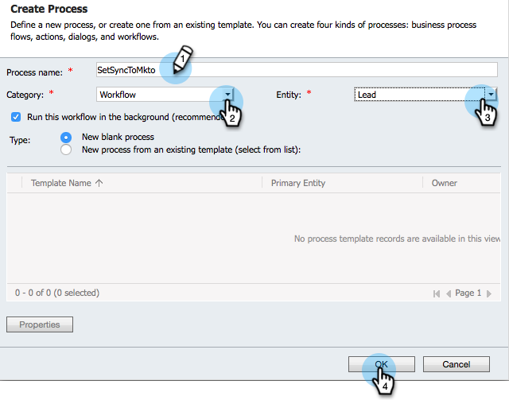

# Skapa ett anpassat Dynamics-synkroniseringsfilter {#create-a-custom-dynamics-sync-filter}

Vill du inte synkronisera allt i Dynamics CRM till Marketo? Oroa dig inte! Med Marketo kan du konfigurera ett synkroniseringsfilter och bara synkronisera en del av dina poster.

## Översikt {#overview}

Så här ställer du in ett Dynamics-synkroniseringsfilter:

1. Skapa ett eget booleskt fält med namnet new_synctomkto i Dynamics CRM för alla objekt (lead, kontakt, konto, möjlighet och andra anpassade entiteter).
1. Tilldela det här fältet ett Ja/Nej-värde eller lämna det tomt.

>[!NOTE]
>
>Du måste göra dessa ändringar i Dynamics CRM, inte i databasen eller Marketo.

Marketo letar efter det här fältet under den automatiska bakgrundssynkroniseringen och avgör vilka poster som ska synkroniseras över baserat på den här logiken:

| Fältvärde | Vill du synkronisera med Marketo? |
|---|---|
| Fältet finns inte | Ja |
| Fältet är tomt | Ja |
| Fältet har värdet Ja | Ja |
| Fältet har värdet Nej | Nej |

>[!CAUTION]
>
>Det enda sättet att tala om för Marketo att hoppa över en post är att ställa in fältvärdet explicit till att vara **Nej**. Marketo synkroniserar fortfarande poster över även om fältvärdena är tomma.

>[!PREREQUISITES]
>
>Installera den senaste versionen av Marketo Plug-in (3.0.0.1 eller senare). Gå till Marketo > Admin > Microsoft Dynamics > Hämta Marketo-lösning.

## Skapa SyncToMkto-fält {#create-synctomkto-field}

1. Logga in i Dynamics CRM. Klicka **Inställningar** och sedan klicka **Anpassningar**.

   

1. Klicka **Anpassa systemet**.

   

1. Klicka  nästa **Enheter**.

   

1. Klicka  nästa **Lead** och markera **Fält**. Klicka sedan på **Nytt**.

   

1. Retur **SyncToMkto** i **Visningsnamn** fält och markera **Två alternativ** som **Datatyp**. Klicka sedan på **Spara och stäng**.

   

   >[!NOTE]
   >
   >Välj ett visningsnamn för det här fältet, men fältet Namn måste vara exakt **new_synctomkto**. Du måste använda **new** som standardprefix. Om du har ändrat standardinställningen går du hit till [återställ standardprefixet för anpassade fältnamn](/help/marketo/product-docs/crm-sync/microsoft-dynamics-sync/create-a-custom-dynamics-sync-filter/set-a-default-custom-field-prefix.md). Du kan ändra tillbaka när du har skapat de nya fälten.

   >[!NOTE]
   >
   >Om du har konfigurerat ett asynkront arbetsflöde får posten det standardvärde för SyncToMkto som du har konfigurerat i fältet och det korrekta värdet hämtas några sekunder senare när arbetsflödet har slutförts. Om standardvärdet är Ja skapas posterna i Marketo och blir sedan inaktuella. Använd **Nej** som standardvärde för att undvika detta.

1. Upprepa den här processen och skapa **SyncToMkto** fält för andra entiteter som du vill begränsa synkroniseringen för, t.ex. kontakt, konto, affärsmöjlighet och anpassade entiteter.

## Markera filtret i Marketo {#select-the-filter-in-marketo}

Även om du redan har gjort den första synkroniseringen går du in och väljer fälten som ska synkroniseras med Marketo.

1. Gå till Admin och välj **Microsoft Dynamics**.

   

1. Klicka **Redigera** i Fältsynkroniseringsinformation.

   

1. Rulla ned till fältet och kontrollera det. Det faktiska namnet måste vara new_synctomkto, men visningsnamnet kan vara vad som helst. Klicka **Spara**.

   

Bra, nu har du aktiverat synkroniseringsfiltret för Marketo.

## Skapa ett Dynamics-arbetsflöde för att tilldela synkroniseringsfiltervärden automatiskt {#create-a-dynamics-workflow-to-assign-sync-filter-values-automatically}

Du kan alltid manuellt tilldela ett värde till SyncToMkto-fälten för dina poster. Men varför inte utnyttja kraften i ett Dynamics-arbetsflöde och automatiskt tilldela ett värde till SyncToMkto-fältet när en post skapas eller uppdateras?

>[!NOTE]
>
>Du kan inte göra detta på databasnivå. Det måste göras manuellt i CRM eller med hjälp av ett arbetsflöde.
>
>Ett Dynamics-arbetsflöde fungerar bara på nya poster som skapas framåt, inte på historiska data. Använd en batchuppdatering för att flytta över befintliga poster.

1. Gå till Dynamics CRM. Klicka **Inställningar** sedan klicka **Processer**.

   

1. Klicka **Nytt**.

   

1. Ange ett namn för arbetsflödet och välj **Arbetsflöde** som kategori och **Lead** som enhet. Klicka sedan på **OK**.

   

1. Skapa regler för att tilldela ett sant eller falskt värde till **SyncToMkto** baserat på organisationens önskemål. Klicka **Spara och stäng**.

   

   >[!NOTE]
   >
   >Definiera en standardåtgärd när du har klickat **Lägg till steg** om du vill lägga till ett kontrollvillkor. Detta anger de poster som du inte vill synkronisera med **Nej**. Annars synkroniseras de.

1. Markera arbetsflödet och klicka på **Aktivera**.

   

   >[!TIP]
   >
   >Se [Anpassade synkroniseringsfilterregler för en e-postadress](/help/marketo/product-docs/crm-sync/microsoft-dynamics-sync/create-a-custom-dynamics-sync-filter/custom-sync-filter-rules-for-an-email-address.md) för att konfigurera regler för att synkronisera endast poster för personer med e-postadresser.

## Information om synkroniseringsfilter {#sync-filter-details}

Här är några implementeringsdetaljer vi trodde att du borde veta:

1. Starta en synkroniseringsåtgärd

   När **SyncToMkto** värdeändringar från **Nej** till **Ja** meddelar Dynamics Marketo omedelbart att synkroniseringen av den här posten ska börja. Om posten redan finns uppdaterar Marketo den. Annars skapar Marketo posten.

   >[!TIP]
   >
   >A `Create [StartSync]` -åtgärden läggs till i Marketo-loggen när detta händer.

1. Stoppa en synkroniseringsåtgärd

   När en post ändrar sitt SyncToMkto-värde från Ja till Nej, meddelas Marketo om att den här posten inte ska synkroniseras. Posten tas dock inte bort, utan den slutar att hämta uppdateringar och blir föråldrad.

>[!MORELIKETHIS]
>
>* [Microsoft Dynamics Sync-filter: Kvalificera](/help/marketo/product-docs/crm-sync/microsoft-dynamics-sync/create-a-custom-dynamics-sync-filter/microsoft-dynamics-sync-filter-qualify.md)
>* [Microsoft Dynamics Sync-filter: Sammanfoga](/help/marketo/product-docs/crm-sync/microsoft-dynamics-sync/create-a-custom-dynamics-sync-filter/microsoft-dynamics-sync-filter-merge.md)
>* [Anpassade synkroniseringsfilterregler för en e-postadress](/help/marketo/product-docs/crm-sync/microsoft-dynamics-sync/create-a-custom-dynamics-sync-filter/custom-sync-filter-rules-for-an-email-address.md)

