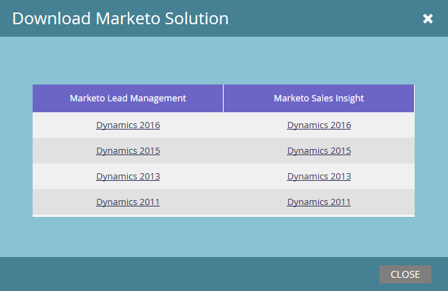

# Marketo Plugin Releases for Microsoft Dynamics {#marketo-plugin-releases-for-microsoft-dynamics}

När du först synkroniserar med Microsoft Dynamics hämtar du den senaste versionen av plugin-programmen för Marketo. Marketo uppdaterar dessa plugin-program regelbundet så att du kan gå tillbaka till samma ställe och ladda ned den nya versionen.

[Hämta den senaste plugin](sync-setup/download-the-marketo-lead-management-solution.md) som motsvarar din Dynamics-release.

Tabellen nedan visar de senaste versionerna.

>[!NOTE]
>
>Dessa versioner fungerar både lokalt och online för Dynamics.

<table> 
 <tbody> 
  <tr> 
   <th colspan="1">Version</th> 
   <th colspan="1">Releasedatum</th> 
   <th>Anteckningar</th> 
  </tr> 
  <tr> 
   <td colspan="1">4.0.0.24</td> 
   <td colspan="1">8/22/18</td> 
   <td colspan="1">Utökat stöd för färdiga produkter berättigar till kontaktprocess för Microsoft Dynamics version 9.x.</td> 
  </tr> 
  <tr> 
   <td colspan="1">4.0.0.23</td> 
   <td colspan="1">6/27/18</td> 
   <td colspan="1">Felkorrigering: Affärsprocessfel vid försök att installera Marketo Solutions för Dynamics 2013.</td> 
  </tr> 
  <tr> 
   <td colspan="1">4.0.0.22</td> 
   <td colspan="1">9/29/17</td> 
   <td colspan="1">Felkorrigering: Intern revision.</td> 
  </tr> 
  <tr> 
   <td colspan="1">
4.0.0.21
</td> 
   <td colspan="1">11/9/16</td> 
   <td colspan="1">Felkorrigering: Plugin-programmet prenumererade inte på händelser som fångar upp det anpassade objektets statusändring. Den här korrigeringen är specifik för Dynamics CRM On Premise 2011. </td> 
  </tr> 
  <tr> 
   <td colspan="1">4.0.0.20</td> 
   <td colspan="1">7/22/16</td> 
   <td colspan="1">Felkorrigering: Uppdateringar av kontaktrollen för affärsmöjlighet hämtades inte fullständigt.</td> 
  </tr> 
  <tr> 
   <td colspan="1">4.0.0.19</td> 
   <td colspan="1">6/28/16</td> 
   <td colspan="1">
Felkorrigering: En onödig uppdateringstransaktion för kundaffärsmöjlighetsrollen i marknadsföringsloggen noterades när affärsmöjligheten skapades. 

Felkorrigering: En extra raderingstransaktion loggades när kundens affärsmöjlighetsroll togs bort.
</td> 
  </tr> 
  <tr> 
   <td colspan="1">4.0.0.18</td> 
   <td colspan="1">5/31/16</td> 
   <td colspan="1">Felkorrigering:  Uppdaterade och tog bort anpassade objekt asynkront.</td> 
  </tr> 
  <tr> 
   <td colspan="1">4.0.0.17</td> 
   <td colspan="1">4/8/16</td> 
   <td colspan="1">Felkorrigering: När leadet hade ett synkroniseringsfilter inställt på NO, och affärsmöjligheten och kontakten inte hade något synkroniseringsfilter, genererades inte Skapa logg för kontakten och affärsmöjligheten när leadet kvalificerades.</td> 
  </tr> 
  <tr> 
   <td colspan="1">4.0.0.16</td> 
   <td colspan="1">3/29/16</td> 
   <td>Felkorrigering: En Tilldelningshändelse loggades när synkroniseringsfiltret stängdes av.</td> 
  </tr> 
  <tr> 
   <td colspan="1">4.0.0.15</td> 
   <td colspan="1">3/3/16</td> 
   <td colspan="1">Felkorrigering: Kunden kunde inte skapa ett lead i CRM eftersom inloggningsanvändaren inte har behörighet för Marketo Config.</td> 
  </tr> 
  <tr> 
   <td colspan="1">4.0.0.14</td> 
   <td colspan="1">1/18/16</td> 
   <td colspan="1">Felkorrigering: Skapade åtkomstbegränsningar för normala Dynamics-användare för att bemöta säkerhetsproblem.</td> 
  </tr> 
  <tr> 
   <td colspan="1">4.0.0.13</td> 
   <td colspan="1">12/30/15</td> 
   <td>Felkorrigering: Uppdateringar i Dynamics synkroniserades inte till Marketo för steg och bilder.</td> 
  </tr> 
  <tr> 
   <td colspan="1">4.0.0.12</td> 
   <td colspan="1">11/12/15</td> 
   <td colspan="1">Felkorrigering: Leadposter synkroniserades till Marketo när synkroniseringsfiltret var inställt på false.</td> 
  </tr> 
 </tbody> 
</table>

>[!MORELIKETHIS]
>
>* [Ladda ned Marketo Lead Management Solution](sync-setup/download-the-marketo-lead-management-solution.md)

