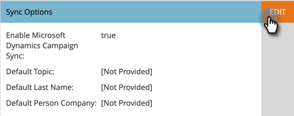

# Aktivera kampanjsynkronisering {#enable-campaign-sync}

Med det här alternativet kan Marketo Engage lägga till och ta bort medlemmar från MS Dynamics Campaign.

>[!PREREQUISITES]
>
>Uppdatera till den senaste versionen av Dynamics-plugin för Marketo.

>[!NOTE]
>
>**Administratörsbehörigheter krävs**

1. Klicka på **[!UICONTROL Admin]** i My Marketo.

   

1. Klicka på **[!UICONTROL Microsoft Dynamics]**.

   

1. Klicka på **[!UICONTROL Edit]** under Synkroniseringsalternativ.

   

1. Markera kryssrutan **[!UICONTROL Enable Microsoft Dynamics Campaign Sync]** och klicka på **[!UICONTROL Save]**.

   

Där har du den. Ge bara synkroniseringen lite tid att hämta data från Microsoft Dynamics så är du redo att gå.

>[!NOTE]
>
>Om du återställer kryssrutan Dynamics Campaign-synkronisering uppdateras alla tidigare synkroniserade kampanjdata och associationerna med marknadsföringslistorna i Dynamics.
