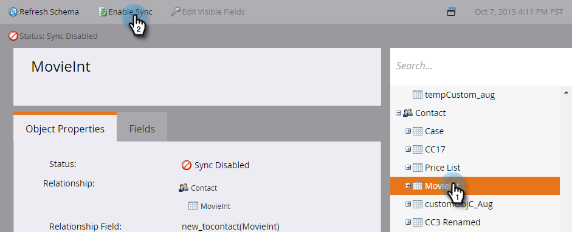

# Aktivera synkronisering för en anpassad entitet {#enable-sync-for-a-custom-entity}

Om du vill att anpassade entitetsdata från Dynamics ska vara tillgängliga i Marketo Engage, så här aktiverar du synkroniseringen för den. **Administratörsbehörighet krävs**.

>[!PREREQUISITES]
>
>Om du vill använda ett anpassat objekt måste det vara associerat med ett [lead](/help/marketo/product-docs/crm-sync/microsoft-dynamics-sync/microsoft-dynamics-sync-details/microsoft-dynamics-sync-lead-sync.md){target="_blank"}-, [contact](/help/marketo/product-docs/crm-sync/microsoft-dynamics-sync/microsoft-dynamics-sync-details/microsoft-dynamics-sync-contact-sync.md){target="_blank"}- eller [account](/help/marketo/product-docs/crm-sync/microsoft-dynamics-sync/microsoft-dynamics-sync-details/microsoft-dynamics-sync-account-sync.md){target="_blank"} -objekt i Microsoft Dynamics.

>[!NOTE]
>
>* När du aktiverar synkronisering för en anpassad enhet utför Marketo en inledande synkronisering för att hämta alla data för det anpassade objektet.
>* Medlemmar i marknadsföringslistan och marknadsföringslistan stöds _inte_ just nu.

>[!IMPORTANT]
>
>Marketo Sync User behöver läsåtkomst till det anpassade objektet för att kunna lista det och synkronisera det.

1. Gå till avsnittet **[!UICONTROL Admin]**.

   

1. Markera **[!UICONTROL Microsoft Dynamics]** och klicka på **[!UICONTROL Disable Sync]**.

   

   >[!NOTE]
   >
   >Du måste inaktivera den globala synkroniseringen tillfälligt för att aktivera eller inaktivera en anpassad entitet.

1. Klicka på **[!UICONTROL Dynamics Entities Sync]** under Databashantering.

   

1. Klicka på **[!UICONTROL Sync schema]**.

   

1. Markera den entitet som du vill synkronisera och klicka på **[!UICONTROL Enable Sync]**.

   

1. Markera de fält som du vill synkronisera eller använda som [begränsningar](/help/marketo/product-docs/core-marketo-concepts/smart-lists-and-static-lists/using-smart-lists/add-a-constraint-to-a-smart-list-filter.md){target="_blank"} och/eller utlösare (för poster som lagts till, _inte_ uppdaterat) i smarta listor. När du är klar klickar du på **[!UICONTROL Enable Sync]**.

   

   >[!NOTE]
   >
   >Under synkroniseringsprocessen kan du märka att objektet [!UICONTROL Dynamic Entities Sync] försvinner från navigeringsträdet. Detta beteende förväntas och kommer att visas igen när synkroniseringen är klar.

1. Enheten har nu en grön bock.

   

1. Glöm inte att aktivera den globala synkroniseringen igen!

   

   >[!NOTE]
   >
   >* Marketo stöder bara anpassade entiteter som är länkade till standardenheter på en eller två nivåer.
   >
   >* Det anpassade objektträdet kan visa samma objekt flera gånger på grund av dess direkta anslutningar till ett av huvudobjekten (t.ex. leads, kontakter eller konton eller indirekta anslutningar via ett mellanliggande objekt). I så fall väljer du det objekt som ligger närmast huvudobjektet och väljer bara ett. Om du väljer samma objekt flera gånger kan det försvåra synkroniseringen av det anpassade objektet.
