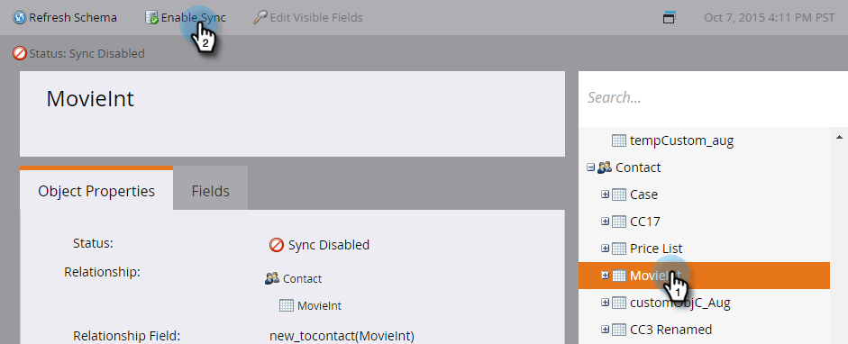

# Aktivera synkronisering för en anpassad entitet {#enable-sync-for-a-custom-entity}

Om du vill att anpassade entitetsdata från Dynamics ska vara tillgängliga i Marketo, så här aktiverar du synkroniseringen:

>[!NOTE]
>
>**Administratörsbehörigheter krävs**

1. Gå till avsnittet **Admin**.

   

1. Välj **Microsoft Dynamics** och klicka på **Inaktivera synkronisering**.

   Du måste inaktivera den globala synkroniseringen tillfälligt för att kunna aktivera eller inaktivera en anpassad entitet.
   

1. Klicka på länken** Dynamics Entities Sync** under Databashantering.

   

1. Klicka på länken **Synkronisera schema**.

   

1. Markera den enhet som du vill synkronisera och klicka på **Aktivera synkronisering**.

   

1. Markera de fält som du vill synkronisera eller använda som [begränsningar](../../../../../product-docs/core-marketo-concepts/smart-lists-and-static-lists/using-smart-lists/add-a-constraint-to-a-smart-list-filter.md) och/eller utlösare i smarta listor. När du är klar klickar du på **Aktivera synkronisering**.

   

   >[!NOTE]
   >
   >Under synkroniseringsprocessen kan du se att objektet Synkronisera dynamiska entiteter försvinner från navigeringsträdet. Detta beteende förväntas och kommer att visas igen när synkroniseringen är klar.

1. Enheten har nu en grön bockmarkering.

   

1. Glöm inte att aktivera den globala synkroniseringen igen!

   

Absolut! Kraftfulla grejer.
