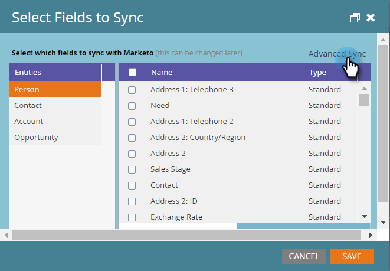

# Använd snabbsynkronisering med Microsoft Dynamics för ett nytt anpassat fält {#use-quick-sync-with-microsoft-dynamics-for-a-new-custom-field}

Marknadsförare eller säljare vill ha ett nytt fält. Eller så kanske du har glömt en i det ursprungliga fältvalet. Eller så har du ändrat dina behov. I vilket fall som helst kan du använda Snabbsynkronisering för att synkronisera om specifika fält.

I vanliga fall använder du Snabbsynkronisering för att lägga till ett nytt fält och uppdatera värdena. I vissa fall kanske du vill synkronisera ett befintligt fält. Du kan begränsa fältsynkroniseringen baserat på ett uppdaterat eller skapat datumintervall. Mer information finns i [Avancerade synkroniseringsalternativ](#Advanced_Sync_Options) nedan.

Snabbsynkronisering kan synkronisera null-värden. Om du till exempel använder värdena A och B och ändrar ett B-värde i Dynamics till null synkroniseras null-värdet till Marketo.

## Snabbsynkronisering för alla poster {#quick-sync-for-all-records}

Så här använder du snabbsynkronisering för att synkronisera om nya fält.

1. I Marketo klickar du på **Admin**.

   

1. Klicka** Microsoft Dynamics**.

   

1. Klicka på **Redigera** på Information om fältsynkronisering.

   

1. Markera de fält som ska snabbsynkroniseras och klicka på **Spara**.

   

   >[!NOTE]
   >
   >Du kan välja fält från flera enheter.

1. Du får ett meddelande när synkroniseringen är klar.

   

   >[!CAUTION]
   >
   >Synkroniseringen körs sida vid sida med andra synkroniseringar, och beroende på databasens storlek kan det ta lång tid att slutföra. När ett fält finns i en kö för synkronisering kan du inte avmarkera det.

## Avancerade synkroniseringsalternativ {#advanced-sync-options}

Vad händer om du vill synkronisera ett befintligt fält, men bara vill göra det för en begränsad uppsättning data? Så här gör du.

1. Avmarkera kryssrutan för ett befintligt fält. Klicka på **Spara**.

   

1. Öppna popup-fönstret igen och markera fältet igen.

   

1. Klicka på **Avancerad synkronisering**.

   

1. Välj **Uppdaterat **och välj ett datumintervall med datumväljarna. Klicka på **Spara**.

   

   Det är bara poster som uppdateras mellan 16 september 2016 och 19 september 2016 som snabbsynkroniseras för fältet.

## Korrigerar ej synkroniserade fält {#fixing-out-of-sync-fields}

I det sällsynta fall där ett Dynamics- och Marketo-fält inte är synkroniserat finns det ett snabbt och enkelt sätt att synkronisera om dem.

1. Avmarkera fältet och klicka på **Spara**.

   

1. Markera fältet igen och klicka på **Spara**. Det är allt!

   

   Det borde fixa det!

